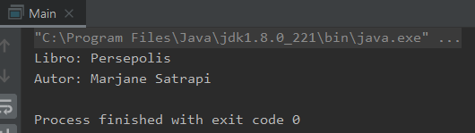

## Ejemplo 4: Programación Orientada a Objetos

### OBJETIVO

- Aplicar las bases de la Programación Orientada a Objetos creando una clase `Libro` que haga uso de una clase `Autor`.
- Separar cada una de las clases dentro de su propio archivo.
- Colocar métodos **getter** y **setter** dentro de las clases para poder leer y establecer los valores de sus atributos.

#### REQUISITOS

1. Tener instalada la última versión del JDK 8.
2. Tener instalada la última versión de IntelliJ IDEA Community.


#### DESARROLLO

1. En el IDE IntelliJ IDEA, crea un nuevo proyecto llamado **OrientacionObjetos**.

2. Dentro del proyecto crea un nuevo paquete llamado **org.bedu.java.jse.basico.sesion1.ejemplo4**.

3. Dentro del paquete anterior crea una nueva clase llamada **Autor** con los siguientes atributos:
	- nombre
	- apellido
	- edad

para cada uno de los atributos anteriores agrega un método **getter** y **setter**:

```java
public class Autor {
    private String nombre;
    private String apellido;
    private int edad;

    public String getNombre() {
        return nombre;
    }

    public void setNombre(String nombre) {
        this.nombre = nombre;
    }

    public String getApellido() {
        return apellido;
    }

    public void setApellido(String apellido) {
        this.apellido = apellido;
    }

    public int getEdad() {
        return edad;
    }

    public void setEdad(int edad) {
        this.edad = edad;
    }
}
```

4. Crea una nueva clase llamada **Libro**; esta clase hará uso de una instancia de `Autor` como uno de sus atributos. La clase libro tendrá los siguientes atributos, con sus correspondientes *getters**:
	 - titulo
	 - autor
	 - numeroPaginas

```java
public class Libro {
    private String titulo;
    private Autor autor;
    private int numeroPaginas;

    public String getTitulo() {
        return titulo;
    }

    public void setTitulo(String titulo) {
        this.titulo = titulo;
    }

    public Autor getAutor() {
        return autor;
    }

    public void setAutor(Autor autor) {
        this.autor = autor;
    }

    public int getNumeroPaginas() {
        return numeroPaginas;
    }

    public void setNumeroPaginas(int numeroPaginas) {
        this.numeroPaginas = numeroPaginas;
    }
}
```

6. Crea una clase **OrientacionObjetos** y dentro de esta un método **main**:
```java
	public class OrientacionObjetos {

		public static void main(String[] args) {
	
		}
	}
```

7. En el método **main** crea una nueva instancia de `Autor` estableciendo sus atributos:

```java
    public static void main(String[] args) {
        
	Autor autor = new Autor();
        autor.setNombre("Marjane");
        autor.setApellido("Satrapi");
        autor.setEdad(50);
	
    }
	
```

8. Ahora, crea una instancia de la clase **Libro**, y establece sus atributos. No olvides usar la instancia de **Autor** creada hace un momento:

```java
        Libro libro = new Libro();
        libro.setAutor(autor);
        libro.setTitulo("Persepolis");
        libro.setNumeroPaginas(368);
```

10. Para terminar, muestra en pantalla el nombre del libro y, en una línea diferente, el nombre del autor:

```java
	System.out.println("Libro: " + libro.getTitulo() );
        System.out.println("Autor: " + libro.getAutor().getNombre() + " " + libro.getAutor().getApellido());
```

11. Al ejecutar la aplicación, la salida debe ser la siguiente:


