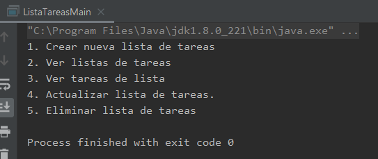

## Postwork 01: Menú de opciones para nuestro proyecto.

### OBJETIVO

- Crear un proyecto Java en IntelliJ IDEA.
- Mostrar una serie de valores en consola, que servirán como menú de opciones para el proyecto del curso.

#### REQUISITOS

1. Tener instalada la última versión del JDK 8.
2. Tener instalada la última versión de IntelliJ IDEA Community.

#### DESARROLLO

Crearás una aplicación que en este punto sólo desplagará un menú de opciones, las cuales más adelante nos permitirán seleccionar las funciones que deberá ejecutar la aplicación final. Las opciones que debe contener son:

* Crear nueva lista de tareas
* Ver listas de tareas
* Ver tareas de lista
* Actualizar lista de tareas.
* Eliminar lista de tareas

1. Crea un nuevo proyecto Java en IntelliJ IDEA llamado **ListaTareas**.

2. Crea un nuevo paquete llamado `org.bedu.java.jse.basico`.

3. Dentro del paquete crear una nueva clase llamada `ListaTareasMain`.

4. Crea un nuevo método **main** dentro de la clase que acabas de crear.

5. Imprime el menú anterior usando la instrucción `System.out.println`.

