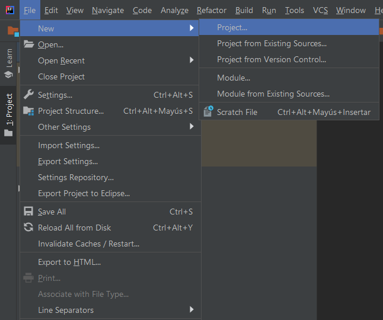
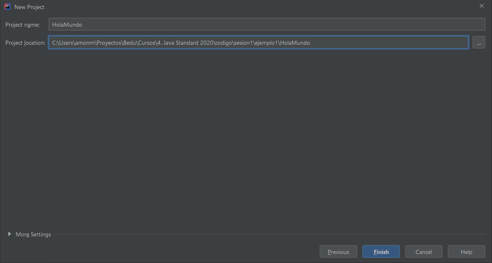
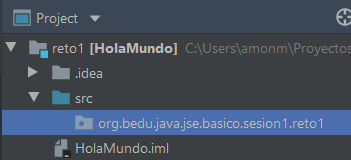
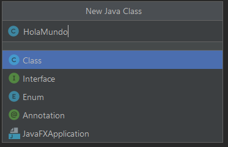
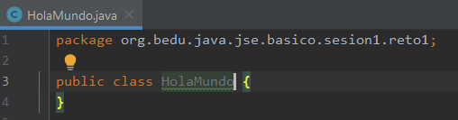
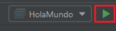
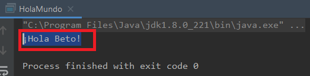

## Reto 01: Saluda con tu nombre

### OBJETIVO 

- Crear un nuevo proyecto Java sin ayuda del instructor
- Crear nuevos paquetes y clases
- Ejecutar una aplicación desde el IDE

#### REQUISITOS 
1. Tener instalada la última versión del JDK 8.
2. Tener instalada la última versión de IntelliJ IDEA Community


#### DESARROLLO

Crea una nueva aplicación Java que imprima en consola `¡Hola [tu nombre]!`.
Utiliza el IDE IntelliJ IDEA, con la versión 8 de Java.

<details>
	<summary>Solucion</summary>
	
1. Abre IntelliJ IDEA, y en el menú `File` selecciona la opción `New -> Project...`.



2. En la opción de **Project SDK** asegúrate de tener seleccionada la versión 1.8 (o superior). No selecciones ninguna librería ni framework adicional.


3. En la siguiente ventana, NO selecciones la opción para crear un nuevo proyecto desde un template; debes crear todos los elementos necesarios a mano en los siguientes pasos.


4. Dale un nombre al proyecto, como **Hola Mundo**.




5. Presiona el botón `Finish` y con esto tu nuevo proyecto deberá aparecer en el panel `Project`, ubicado a la izquierda del IDE:


6. Expande el proyecto *HolaMundo* y en la carpeta llamada `src`, haz clic derecho y selecciona `New -> Package`. Recuerda que un paquete permite agrupar los elementos de nuestra aplicación para tenerlos de una forma ordenada.


7. Como nombre del paquete escribe: 
		
		org.bedu.java.jse.basico.sesion1.reto1
		
		



8. En el nuevo paquete que acabas de crear, haz clic derecho y selecciona la opción `New -> Java Class`.


9. En la ventana emergente, asegúrate de que esté seleccionada la opción `Class` y escribe **HolaMundo** como nombre de la clase.




10. Tu nueva clase aparecerá en el editor de código del IDE:




11. Recuerda que el método ***main*** es el punto de entrada en toda aplicación Java, por lo que debes escribir uno para poder colocar adentro tu código y que este sea ejecutado por la computadora. El método main tiene una *firma* estándar y prácticamente siempre es la misma. Adentro de la clase **HolaMundo** escribe:

```java
public static void main(String[] args) {
        
}
```


12. Con esto, lo único que falta es escribir el código que se ejecutará. En este caso será la salida en consola del texto `Hola Mundo`. Para esto, escribe el siguiente código dentro del método *main*:

```java
System.out.println("¡Hola Beto!");
```

Recuerda que debes usar tu propio nombre.

el archivo completo debe tener el siguiente contenido:
```java
public class HolaMundo {
    public static void main(String[] args) {
        System.out.println("¡Hola Beto!");
    }
}
```

13. Recuerda, el último paso es ejecutar la aplicación. La forma más sencilla es hacer clic derecho en el editor de código, con lo que aparecerá un menú; en este menú selecciona `Run 'HolaMundo.main()'`:

.

Esto debes hacerlo solo la primera vez, posteriormente ya podrás ejecutar la aplicación con el botón Run que aparece en la parte superior derecha del editor.




14. Si no hay errores en el código, se abrirá el panel de ejecución, en el cual verás el texto `¡Hola Beto!`.



	
</details> 
