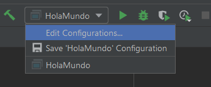
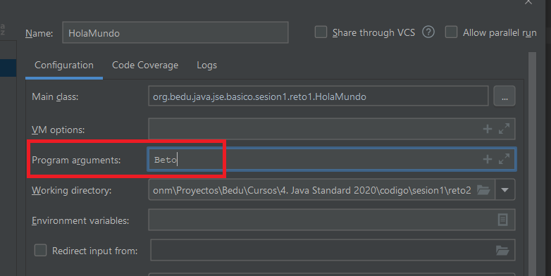
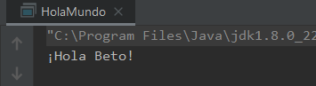

 ## Reto 02: Recepción de parámetros desde IntelliJ IDEA 

### OBJETIVO 

- Aprender a modificar las configuraciones de ejecución de la aplicación en el IDE.
- Aprender a recibir parámetros en el método *main* de la aplicación.
- Aprender a concatenar valores para imprimir los valores en pantalla.

#### REQUISITOS 

1. Tener instalada la última versión del JDK 8.
2. Tener instalada la última versión de IntelliJ IDEA Community

#### DESARROLLO

- Realiza las modificaciones necesarias en tu clase HolaMundo, del Reto 01, para usar un valor recibido desde la línea de comandos, el cual será tu nombre, para imprimir este como salida de la aplicación; esto nos evitará tener dicho valor en "*código duro*".

- Modifica la configuración de ejecución del IDE para para tu nombre como un argumento de la aplicación.

**Tip #1**: Para concatenar cadenas usamos el operador **+** (signo de suma).

**Tip #2**: Para obtener el valor de tu nombre debes usar la instrucción `args[0]`.

<details>
	<summary>Solución</summary>

1. En el cuerpo del método *main* de la aplicación, modifica la cadena que pasas al método `println` borrando el nombre que muestra (en mi caso **Beto**) y sustitúyelo por el valor recibido como parámetro, usando la instrucción que se muestra en el tip #2; recuerda que para concatenar cadenas debes usar el operador de suma (**+**).

```java
System.out.println("¡Hola " + args[0] + "!");
```

2. Ve a la opción `Edit Configurations...` que aparece al desplegar la lista de opciones para la configuración de la aplicación, que está en la parte superior derecha del editor de código.



3. En la ventana que aparece, localiza el campo marcado como `Program arguments:`, y coloca ahí tu nombre.



4. Presiona el botón `Ok` para aplicar y guardar la nueva configuración.

5. Ejecuta nuevamente la aplicación y deberás ver en la consola una salida igual a la anterior.



Prueba cambiando el parámetro que envías para ver los cambios en la salida de la aplicación. De esta forma evitas tener que estar modificando y volviendo a compilar el código de tu aplicación cada vez que quieras cambiar un valor.

Ahora, averigua cómo puedes hacer esto mismo, pero ejecutando tu aplicación desde una línea de comandos, y no desde el IDE.


 </details> 
