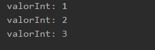
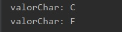

## Ejemplo 01: Declaración y asignación de valores a tipos primitivos.

### OBJETIVO

- Aprender las reglas de declaración y asignación de valores literales a tipos primitivos.

#### REQUISITOS
1. Tener instalada la última versión del JDK 8.
2. Tener instalada la última versión de IntelliJ IDEA Community


#### DESARROLLO

1. Crea un nuevo proyecto en IntelliJ IDEA, llamado **Primitivos**.

2. Dentro del proyecto crea un nuevo paquete llamado **org.bedu.java.jse.basico.sesion2.ejemplo1**.

3. Dentro del paquete anterior crea una nueva clase llamada **Primitivos** y dentro de esta un método **main**.

4. Dentro del método `main` iniciaremos declarando algunas variables primitivas, todas con el valor literal 1:

```java
        byte valorByte = 1;
        short valorShort = 1;
        int valorInt = 1;
        long valorLong = 1L;

        float valorFloat = 1.5F;
        double valorDouble = 1.5;
```
	
**Nota:** Recuerda que en el caso de los valores **long** y **float** debemos usar los postfijos ***L*** y ***F*** respectivamente. Intenta colocar estos postfijos como minúsculas y ve qué ocurre; también, intenta eliminar estos postfijos para ver qué ocurre y responde ¿por qué ocurre esto?

5. Ahora, imprimiremos los valores de cada una de las variables.

```java 
	System.out.println("byte: " + valorByte);
        System.out.println("short: " + valorShort);
        System.out.println("int: " + valorInt);
        System.out.println("long: " + valorLong);

        System.out.println("float: " + valorFloat);
        System.out.println("double: " + valorDouble);
```	

6. Ahora, agregaremos una variable tipo `boolean` y otra tipo  `char` e imprimiremos sus valores en la consola.

```java
	boolean valorBoolean = true;
        char valorChar = 'B';
	System.out.println("boolean: " + valorBoolean);
        System.out.println("char: " + valorChar);
```

7. Ejecuta la aplicación y ve el resultado obtenido.

8. Ahora, haremos algunos casteos de tipos para ver qué ocurre. Declara la siguiente variable de tipo `float` y luego asígnala a una variable de tipo `int`.

```java
 	float numFloat = 1.5f;
        int numInt1 = (int)numFloat;
        System.out.println("numInt1: " + numInt1);
	
```

¿Cuál es la salida de la aplicación? ¿puedes explicar por qué se obtiene esta salida?

9. Ahora, haremos un casteo entre un tipo `char` y un tipo `int`, de la siguiente forma:

```java
 	char numChar = 'M';
        int numInt2 = (int)numChar;
        System.out.println("numInt2: " + numInt2);
```

Como podemos ver, este cast es posible y al final obtenemos como salida un número entero. Este número entero es el que representa al caracter como valor ASCII. Puede ver otros valores en esa tabla de valores ascii http://www.asciitable.com/.

10. Finalmente, intentaremos hacer el casteo de un valor `boolean` a un valor  `int`, de la siguiente forma:

```java
        boolean numBool = true;
        int numInt3 = (int)numBool;
```
¿Qué ocurre en este caso? ¿puedes explicar por qué?

11. Para terminar, haremos uso de algunos de los operadores aritméticos que se pueden usar con este tipo de variables. Primero mostraremos el valor actual de la variable `valorInt`:

```java
	System.out.println("valorInt: " + valorInt);
```

12. Ahora, sumaremos a `valorInt` el valor de 1 y lo asignaremos a la misma variable `valorInt`, para luego mostrar nuevamente su valor:

```java
	valorInt = valorInt + 1;
        System.out.println("valorInt: " + valorInt);
```

13. El operador **++** también puede usarse para incrementar en `1` el valor de una variable numérica, de esta forma:

```java
 	valorInt++;
        System.out.println("valorInt: " + valorInt);
```



14. Este mismo operador funciona con variables tipo `char`:
```java
 	valorChar++;
        System.out.println("valorChar: " + valorChar);
```

15. Incluso, podemos realizar la suma de un `int` con un `char`, aunque en este caso será necesario hacer un cast de regreso a `char`, ya que la suma de dos tipos de datos enteros siempre regresará el tipo de dato más grande (en este caso el `int`):
```java
        valorChar = (char)(valorChar + valorInt);
        System.out.println("valorChar: " + valorChar);
```

Finalmente, el valor mostrado debe ser la letra `F`:

