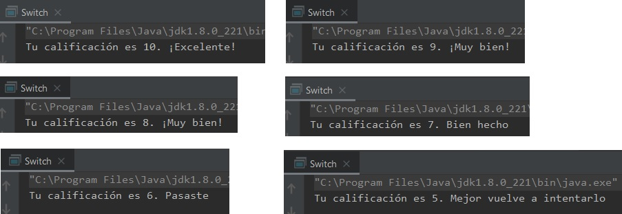
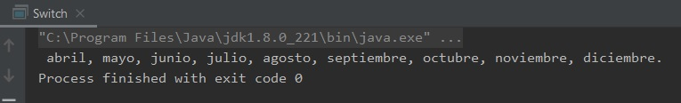
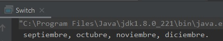

## Ejemplo 02: Uso de switch

### OBJETIVO

- Aprender el uso de la sentencia switch, usando casos de tipo numérico y String.

#### REQUISITOS
1. Tener instalada la última versión del JDK 8.
2. Tener instalada la última versión de IntelliJ IDEA Community


#### DESARROLLO

Usando sentencias switch, crea un proyecto que felicite al alumno dependiendo de su calificación. 

Posteriormente, crea otra aplicación que diga cuáles meses faltan para terminar el año.

1. En el IDE IntelliJ IDEA, crea un nuevo proyecto llamado **Switch**.

2. Dentro del proyecto crea un nuevo paquete llamado **org.bedu.java.jse.basico.sesion2.ejemplo2**.

3. Dentro del paquete anterior crea una nueva clase llamada **Switch** y dentro de esta un método **main**.

4. Dentro del método main iniciaremos declarando una sentencia switch, el cual debe cumplir con las siguientes condiciones:
	* Si la calificación es igual a **10** el mensaje debe ser: "**¡Excelente!**".
	* Si la calificación es **9** u **8** el mensaje debe ser: **¡Muy bien!**.
	* Si la calificación es **7** el mensaje debe ser: **Bien hecho**.
	* Si la calificación es **6** el mensaje debe ser: **Pasaste**.
	* Si la calificación es menor a **5** el mensaje debe ser: **Mejor vuelve a intentarlo**.
	
5. Primero, declararemos una variable de tipo **String** que almacenará el mensaje que se mostrará.

```java
String mensaje;
```

6. Después, una variable que será en la que pondremos la calificación, la cual en este momento no tendrá ningún valor, como la calificación sólo tendrá valores entre 0 y 10 usaremos una variable de tipo **byte**:

```java
byte calificacion;
```

7. Agregaremos la instrucción `switch`. En este caso la variable cuyo valor probaremos será **calificacion**, por lo que iniciamos la instrucción de la siguiente forma:
```java
switch(calificacion) {
}
```

8. Dentro de cada uno de los `case` asignaremos un valor a **mensaje** dependiendo de la calificación obtenida. En primer lugar, iniciaremos con la calificación de **10**:

```java
	case 10:
		mensaje = "¡Excelente!";
                break;
```

9. Después, colocaremos los casos para las calificaciones de **9** y **8**; ya que ambos mostrarán el mismo mensaje, podemos colocar dos `case`, uno seguido del otro, y posteriormente realizar la asignación del mensaje:

```java
	case 9:
        case 8:
                mensaje = "¡Muy bien!";
                break;

```

10. Los siguientes casos, para el **7** y el **6** son idénticos al caso del **10**, probamos los valores individuales y asignamos el mensaje correspondiente:

```java
            case 7:
                mensaje = "Bien hecho";
                break;
            case 6:
                mensaje = "Pasaste";
                break;
```

11. Para terminar, con los valores del **5** al **0** podemos usar la instrucción **default**, que es como decir: "En cualquier otro caso, ejecuta estas instrucciones". Lo colocaremos de la siguiente forma:

```java
	default :
                mensaje = "Mejor vuelve a intentarlo";
```

La instrucción **switch** completa debe verse de la siguiente forma:

 ```java
 	switch(calificacion) {
            case 10:
                mensaje = "¡Excelente!";
                break;
            case 9:
            case 8:
                mensaje = "¡Muy bien!";
                break;
            case 7:
                mensaje = "Bien hecho";
                break;
            case 6:
                mensaje = "Pasaste";
                break;
            default :
                mensaje = "Mejor vuelve a intentarlo";
        }
 ```

Nota que en cada `case` hemos puesto una instrucción **break** que indica que se termina la ejecución de ese `case`.

12. Ahora, mostraremos un mensaje que nos diga cuál es la calificación y el mensaje que le daremos al alumno, de la siguiente forma:

```java
	System.out.println("Tu calificación es " + calificacion + ". " + mensaje);
```
En la última sesión veremos cómo podemos mejorar el formato de la instrucción anterior para que sea más clara y fácil de programar.

13. Asigna un valor a la variable **calificacion** para comprobar que el mensaje se muestra de forma correcta.



**Nota:** Hay un problema con el switch anterior, y es que acepta valores negativos y mayores a 10. ¿Puedes corregirlo para que solo acepte valores entre 0 y 10?


14. Ahora, crearemos el segundo switch del ejercicio, en el que mostraremos los meses que hacen falta para terminar el año. Lo que buscamos es que, si estamos en *marzo*, obtengamos como salida:

		abril, mayo, junio, julio, agosto, septiembre, octubre, noviembre, diciembre.
		
Si estamos en *agosto* obtengamos como salida:

		septiembre, octubre, noviembre, diciembre.
		
y si estamos en *diciembre* obtengamos una salida en blanco.

15. Comencemos creando una variable que tendrá el nombre del mes actual:

```java
String mesActual = "junio";
```

16. El **switch** probará el valor de la variable `mesActual`, de esta forma:
```java
switch (mesActual){            
}
``` 

17. A continuación, agregaremos los `case`; tendremos uno para cada mes del año, usando literales de tipo `String`

```java
        switch (mesActual){
            case "enero":
                System.out.println("febrero,");
            case "febrero":
                System.out.println(" marzo,");
            case "marzo":
                System.out.println(" abril,");
            case "abril":
                System.out.println(" mayo,");
            case "mayo":
                System.out.println(" junio,");
            case "junio":
                System.out.println(" julio,");
            case "julio":
                System.out.println(" agosto,");
            case "agosto":
                System.out.println(" septiembre,");
            case "septiembre":
                System.out.println(" octubre,");
            case "octubre":
                System.out.println(" noviembre,");
            case "noviembre":
                System.out.println("diciembre.");
        }
```

fíjate que en este caso no hemos colocado ninguna sentencia **break**, esto nos ayudará a que una vez que se ha encontrado un case de entrada, la ejecución continúe hasta el último case, que en este caso es noviembre. Nota también que no existe un `case` para diciembre, esto es para que en caso de usar ese valor obtengamos una salida vacía.

18. Ejecuta la aplicación y debes obtener una salida similar a la siguiente. Con el valor **marzo**:



con el valor **agosto**:



¡Felicidades!, con esto has aplicado correctamente el uso de la sentencia ***switch***.
