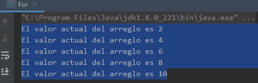

## Ejemplo 03: Uso de for y while

### OBJETIVO

- Aplicar el uso del ciclo for para recorrer arreglos de valores.

#### REQUISITOS

1. Tener instalada la última versión del JDK 8.
2. Tener instalada la última versión de IntelliJ IDEA Community

#### DESARROLLO

Usando lo aprendido en clase, crearemos una serie de ciclos que nos ayudarán a recorrer arreglos de valores dentro de un ciclo for.

1. En el IDE IntelliJ IDEA, crea un nuevo proyecto llamado **For**.

2. Dentro del proyecto crea un nuevo paquete llamado **org.bedu.java.jse.basico.sesion2.ejemplo3**.

3. Dentro del paquete anterior crea una nueva clase llamada **For** y dentro de esta un método **main**.

4. Dentro del método main iniciaremos creando un ciclo que nos ayudará a imprimir en consola los valores de 1 al 10, revisa bien la condición en el ciclo.

```java
        for (int i = 1; i <= 10; i++) {
            System.out.println("El valor de i es " + i);
        }
```

5. Ejecuta la aplicación. Debes obtener una salida similar a la siguiente:

		El valor de i es 1
		El valor de i es 2
		El valor de i es 3
		El valor de i es 4
		El valor de i es 5
		El valor de i es 6
		El valor de i es 7
		El valor de i es 8
		El valor de i es 9
		El valor de i es 10
		
6. Ahora, haremos las cosas un poco más complicadas, tomando el valor desde un arreglo de valores enteros. Primero, declararemos el arreglo de valores de la siguiente forma:

```java
short[] valores = {1, 2, 3, 4, 5, 6, 7, 8, 9, 10};
```

7. Los arreglos tienen su primer valor en la posición **0**, por lo que el índice que usemos debe comenzar en este número. Los arreglos contienen un atributo **length** que indica el número de elementos dentro del arreglo; por lo tanto, el ciclo para recorrer e imprimir los valores del arreglo anterior queda de la siguiente forma (revisa la forma en la que hemos indicado la condición y en la que obtenemos el valor actual del arreglo):

```java
	for (int i = 0; i < valores.length; i++) {
            System.out.println("El valor actual del arreglo es " + valores[i]);
        }
```

8. Ejecuta la aplicación, ahora deberá haber una salida como la siguiente en la consola:

		El valor actual del arreglo es 1
		El valor actual del arreglo es 2
		El valor actual del arreglo es 3
		El valor actual del arreglo es 4
		El valor actual del arreglo es 5
		El valor actual del arreglo es 6
		El valor actual del arreglo es 7
		El valor actual del arreglo es 8
		El valor actual del arreglo es 9
		El valor actual del arreglo es 10

9. Ahora, haremos una modificación para solo imprimir los elementos pares. Tenemos dos formas de lograr esto. La primera es usando una sentencia **if** y validar, con el operador **%** si el número que recibimos es múltiplo de dos. La segunda es modificando la sección del **for** que realiza el incremento del índice **i** para que, en vez de incrementar en **1**, incremente en **2**, de la siguiente forma:

```java
for (int i = 1; i < valores.length; i+=2) {
	System.out.println("El valor actual del arreglo es " + valores[i]);
}
```

Con esta modificación, la salida debe ser similar a la siguiente:



10. Finalmente, realizaremos la modificación del ciclo for para recorrer los elementos del arreglo, pero usando la versión mejorada de **for**; esta es una versión con una sintaxis más reducida, de la siguiente forma:

```java
for(short valor : valores){
	System.out.println("El valor actual del arreglo es " + valor);
}
```

Con esto, la salida debe ser:

	El valor actual del arreglo es 1
	El valor actual del arreglo es 2
	El valor actual del arreglo es 3
	El valor actual del arreglo es 4
	El valor actual del arreglo es 5
	El valor actual del arreglo es 6
	El valor actual del arreglo es 7
	El valor actual del arreglo es 8
	El valor actual del arreglo es 9
	El valor actual del arreglo es 10

Ahora, modificaremos la aplicación para hacer uso de un ciclo **while**.

11. Recuerda que en el caso de **while**, la variable que se usa como índice debe declararse e inicializarse afuera del ciclo.

Esta variable podemos incrementarla dentro del ciclo, en la condición, de la siguiente forma:
```java
	short i = 0;

        while (++i <= 10) {
            System.out.println("El valor de i es " + i);
        }
```
12. Ejecuta el código de la aplicación, con lo que debes obtener la siguiente salida:

	     El valor de i es 1
	     El valor de i es 2
	     El valor de i es 3
	     El valor de i es 4
	     El valor de i es 5
	     El valor de i es 6
	     El valor de i es 7
	     El valor de i es 8
	     El valor de i es 9
	     El valor de i es 10

Nota que como estamos incrementando el valor de **i** en la condición, debemos inicializar su valor en **0**. Si queremos cambiar esto, podemos usar un ciclo **do...while**, de la siguiente forma:
 ```java
	short i = 1;

        do {
            System.out.println("El valor de i es " + i);
        } while (i++ < 10);
```
