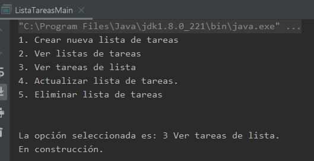

## Postwork 02: Selección de elemento del menú.

### OBJETIVO

- Practicar los elementos aprendidos en la sesión.

#### REQUISITOS

1. El avance del postwork de la sesión 01.

#### DESARROLLO

Continuarás desarrollando tu proyecto personal. En esta ocasión agregaremos una variable que permitirá seleccionar la opción deseada por el usuario. El valor de esta variable estará en código duro, y en la siguiente sesión permitiremos que este sea un valor introducido por el usuario.

También, dependiendo de la opción seleccionada mostraremos un mensaje que indique dicha opción, con número y texto, y el mensaje "**En construcción...***.

<details>
        <summary>Solución</summary>

1. Agrega dos variables, una de tipo **short** para mantener la opción seleccionada por el usuario, y otra de tipo **String** para el mensaje que mostrará la aplicación:

```java
        short opcionSeleccionada = 3;
        String mensaje;
```

2. Usando un bloque **switch** coloca un `case` para cada una de las opciones existentes. Dentro del `case` se establecerá en el mensaje el nombre de la opción seleccionada.

```java
        switch (opcionSeleccionada) {
            case 1:
                mensaje = "Crear nueva lista de tareas.";
                break;
            case 2:
                mensaje = "Ver listas de tareas.";
                break;
            case 3:
                mensaje = "Ver tareas de lista.";
                break;
            case 4:
                mensaje = "Actualizar lista de tareas.";
                break;
            case 5:
                mensaje = "Eliminar lista de tareas.";
                break;
            default:
                mensaje = "Opción desconocida.";
        }
```

3. Para terminar, mostraremos el mensaje con la opción seleccionada, y posteriormente el mensaje **En construcción...***:

```java
        System.out.println("\n\nLa opción seleccionada es: " + opcionSeleccionada + " " + mensaje);
        System.out.println("En construcción.");
```

4. Si ejecutas la aplicación, hasta este momento la salida debe ser similar a la siguiente:





</details>


