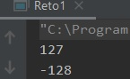
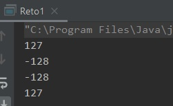

## Reto 01: Desbordamiento de valores

### OBJETIVO 

- Aprender qué pasa cuando se sale de los rangos de los valores aceptados por los tipos primitivos.

#### REQUISITOS 
1. Tener instalada la última versión del JDK 8.
2. Tener instalada la última versión de IntelliJ IDEA Community

#### DESARROLLO

Utilizando lo aprendido hasta ahora, logra convertir números positivos enteros en negativos usando sólo sumas.

<details>
	<summary>Solución</summary>
	
1. Crea un nuevo proyecto en IntelliJ IDEA, llamado Primitivos.

2. Dentro del proyecto crea un nuevo paquete llamado org.bedu.java.jse.basico.sesion2.ejemplo1.

3. Dentro del paquete anterior crea una nueva clase llamada Primitivos y dentro de esta un método main.

4. La forma más fácil de lograr la conversión es usando algo llamado **Desbordamiento de valores**, y esto ocurre cuando intentamos exceder el valor máximo que puede soportar un primitivo entero. El valor más grande que puede tener un byte es 127, comencemos inicializando una variable de este tipo:

**Nota:** Podemos escribir el valor a mano, o usar la constante que proporciona el wrapper `Byte`.

```java
        byte valorByte = Byte.MAX_VALUE;
        System.out.println(valorByte);
```
El primer valor que debemos obtener es `127`.

5. Incrementa el valor de **valorByte** en **1**:

```java
	valorByte += 1;
        System.out.println(valorByte);
```

Ahora, debemos obtener un valor de ***-128***



6. Puedes hacer lo mismo pero con valores negativos:

```java
	valorByte = Byte.MIN_VALUE;
        System.out.println(valorByte);
        valorByte -= 1;
        System.out.println(valorByte);
```
	

	

7. intenta hacer eso mismo con variables no enteras (`float` o `double`). ¿Qué ocurre en esos casos? ¿por qué?.
	
</details> 


