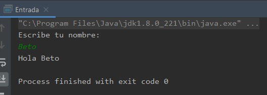
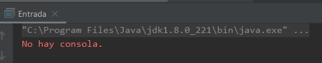

## Ejemplo 01: Lectura desde el teclado con Scanner y Console.

### OBJETIVO

- Aprender distintas formas en las que podemos leer información desde el teclado, para que el usuario interctúe con nuestra aplicación.

#### REQUISITOS

1. Tener instalada la última versión del JDK 8.
2. Tener instalada la última versión de IntelliJ IDEA Community


#### DESARROLLO

1. En el IDE IntelliJ IDEA, crea un nuevo proyecto llamado **Entrada**.

2. Dentro del proyecto crea un nuevo paquete llamado **org.bedu.java.jse.basico.sesion3.ejemplo1**.

3. Dentro del paquete anterior crea una nueva clase llamada **Entrada** y dentro de esta un método **main**.

4. Dentro del método main iniciaremos creando una nueva instancia de la clase **Scanner**, de esta forma:

```java
        Scanner scanner = new Scanner(System.in);
```

**Nota**: No olvides que además de crear la instancia anterior, se debe importar la clase con la instrucción **import java.util.Scanner;**. IntelliJ IDEA hará esto en automático.

5. Ahora colocaremos un mensaje que indique que debemos escribir nuestro nombre. Esto nos ayudará a saber que la aplicación nos está pidiendo interacutar con ella:

```java
	System.out.println("Escribe tu nombre: ");
```

6. Ahora, leeremos la entrada del teclado usando el método **nextLine()** de la clase **Scanner**. Este método lee lo que escribamos, y termina de leer en el momento que presionamos la tecla *Enter*, de esta forma es como le indicamos que hemos terminado de escribir. El valor leído lo almacenamos en la variable **nombre**, la cual será de tipo **String**:

```java
	String nombre = scanner.nextLine();
```

7. Finalmente, una vez que hemos obtenido el valor, lo imprimimos nuevamente:

```java
	System.out.println("Hola " + nombre);
```

8. Ejecutamos la aplicación, y en la consola de IntelliJ IDEA veremos el mensaje solicitando nuestro nombre, en ese momento debemos escribir en la misma consola el valor y terminar la entrada con la tecla *Enter*. Debemos tener una salida similar a la siguiente:



9. Ahora, realizaremos esta misma lectura, pero usando la calse **Console**. Lo primero es obtener una instancia de **Console**, para eso usamos la siguiente instrucción:

```java
	Console console = System.console();
```

10. Ya con la instancia, es una buena práctica el validar que este objeto se haya podido obtener, ya que habrá casos en la que la aplicación se ejecute en un ambiente sin consola. El realizar la siguiente validación nos ayudará a saber si la aplicación se puede ejecutar correctamente:

```java
	if (console == null) {
            System.err.println("No hay consola.");
            System.exit(1);
        }
```

Si no es posible obtener la inst5ancia de la consola, se lanza un error y se termina la ejecución de la aplicación.

11. Una vez que hemos validado que tenemos acceso a la consola, lo siguiente es mostrar el mensaje par escribir el nombre, y luego leer la entrada del usuario. Tenemos dos formas de hacer esto, la primera es muy similar a como lo hicimos con `Scanner`: mostrar un mensaje usando `System.out.println` y luego leyendo la entrada  usando el método **readLine** de la clase **Console**, de la siguiente forma:

```java
	System.out.println("Escribe tu nombre: ");
        String nombre = console.readLine();
```

Sin embargo, la clase **Console** ofrece una forma de combinar las dos acciones anteriores en una sola línea de código, ya que el método **readLine** tiene una otra versión, en la que recibe dos parámetros adicionales, un formato de mensaje, y los valores. No te preocupes mucho por los detalles en este momento, los aclararemos en la última sesión.

```java
	String nombre = console.readLine("%s", "Escribe tu nombre: ");
```

12. Para el último paso, mostraremos el mensaje en pantalla:

```java
	System.out.println("Hola " + nombre);
```

13. Si ejecutamos la aplicación directament en IntelliJ IDEA, obtendremos un error parecido al siguiente:



Esto es porque la aplicación no detecta la consola del IDE como una consola real. Para que el ejemplo funcione, tenemos que ejecutarlo desde una línea de comandos, usando la instrucción **java org.bedu.java.jse.basico.sesion3.ejemplo1.Entrada**


!Feliciades¡ Acabas de interactuar con el usuario, a través del teclado de la computadora.
