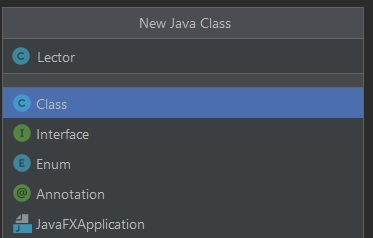
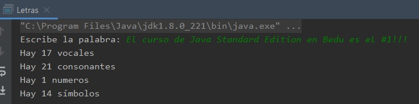

## Ejemplo 02: Clase propia

### OBJETIVO

- Aprender los elementos básicos de la declaración de una clase propia.
- Aplicar la creación de métodos que regresen valores booleanos, numéricos y Strings.

#### REQUISITOS

1. Tener instalada la última versión del JDK 8.
2. Tener instalada la última versión de IntelliJ IDEA Community


#### DESARROLLO

Usando una lógica similar a la del reto 1, crear una clase que indique cuántas vocales, consonantes, números y símbolos hay en una cadena ingresada por el usuario.

1. En el IDE IntelliJ IDEA, crea un nuevo proyecto llamado **Letras**.

2. Dentro del proyecto crea un nuevo paquete llamado **org.bedu.java.jse.basico.sesion3.ejemplo2**.

3. Dentro del paquete anterior crea una nueva clase llamada **Letras** y dentro de esta un método **main**. Esta clase será el punto de entrada de la aplicación, pero no en la que se ejecute la lógica principal de la aplicación.

4. Crea, también dentro del paquete, una nueva clase llamada **Lector** esta clase será la encargada de manejar la lectura de datos por parte del usuario. Inicialmente será un envoltorio para la clase **Scanner**, pero esto nos dará flexibilidad si más adelante decidimos usar alguna clase distinta para hacer dicha lectura. 



5. Dentro de la clase lector, comencemos declarando e instanciando un *atributo* de tipo **Scanner**:

```java
	private Scanner scanner = new Scanner(System.in);
```

6. Después, declaremos un *método* llamado **muestraMensaje** que recibirá como parámetro el mensaje a mostrar, como una variable de tipo **String** y no regresará ningún valor (**void**). Este método también nos sirve para encapsular la forma en la imprimimos este mensaje:

```java
	public void muestraMensaje(String mensaje){
        	System.out.print(mensaje);
    	}
```

7. Ahora, declaramos un método llamado **leeEntrada**, que no recibirá parámetros y regresará una **String**. Este método usará la instancia de **Scanner** para leer el texto ingresado por el usuario y regresarlo posteriormente:

```java
	public String leeEntrada(){
        	return scanner.nextLine();
    	}
```

con esto, terminamos la clase **Lector**. La clase completa se ve de la siguiente forma:

```java
	package org.bedu.java.jse.basico.sesion3.ejemplo2;

	import java.util.Scanner;

	public class Lector {

	    private Scanner scanner = new Scanner(System.in);

	    public void muestraMensaje(String mensaje){
		System.out.print(mensaje);
	    }

	    public String leeEntrada(){
		return scanner.nextLine();
	    }
	}

```

8. Ahora, creamos una nueva clase llamada **ContadorCaracteres**. Esta clase será quien realice el conteo de cada uno de los tipos que definimos al inicio del ejemplo. Dentro de esta clase crearemos dos tipos de métodos, los primeros se encargarán de recibir un parámetro de tipo **char** y determinar si es de un tipo determinado; el segundo grupo realizará el conteo de los caracteres dentro de la palabra que pertenecen a dicho grupo. Comencemos con el método que determinará si el caracter recibido es una vocal:
```java
    public boolean isVocal(char caracter){
        return (caracter == 'a' || caracter == 'e' || caracter == 'i' || caracter == 'o' || caracter == 'u');
    }
```

9. El siguiente método determinará si el caracter recibido es un número. Para poder hacer esto, nos apoyaremos del valor *ascii* del caracter. Si revisamos en la tabla ASCII (http://www.asciitable.com/), podemos ver que el valor ascii del **0** es *48*, el del **1** es *49*, el del **2** es *50*, etc., hasta llegar a que el valor del número **9** es *57*. Por lo tanto, la validación pude quedar de la siguiente forma, en la que realizamos el casteo del caracter a un número de tipo **short** y verificamos si su valor ascii está entre el 48 y el 57; de ser así, podemos saber que el caracter es un número:

```java
    public boolean isNumero(char caracter){
        short codigoAscii = (short)caracter;
        return codigoAscii >= 48 && codigoAscii <= 57;
    }
```
10. Para saber si se trata de una consonante, podemos hacer algo parecido al caso anterior. Lo primero será convertir el caracter a un **short** y revisar el valor de este `short`, si el valor está entre el *97* (**a**) y el *122* (**z**) y además NO es una vocal, podemos saber que se trata de una consonante. 

```java
    public boolean isConsonante(char caracter){
        short codigoAscii = (short)caracter;
        return (codigoAscii >= 97 && codigoAscii <= 122) && !isVocal(caracter);
    }
```
11. Finalmente, crearemos el método que determinará si el caracter se trata de un símbolo. Este será el método más sencillo de todos, ya que podemos determinar que, si el caracter no es un número, vocal o consonante, se trata de un símbolo. Además, ya tenemos forma de determinar si se trata de alguno de los tipos anteriores:

```java
    public boolean isSimbolo(char caracter){
        return !(isVocal(caracter) || isNumero(caracter) || isConsonante(caracter));
    }
```

12. Ahora, crearemos el segundo grupo de métodos. En estos es donde realizaremos el conteo de los caracteres, apoyándonos en los métodos que acabamos de crear. En el primer método, realizaremos el conteo de las vocales. El nombre de este método será **cuentaVocales**. Primero, crearemos una variable de tipo **int** que mantendrá el conteo de las vocales, el valor inicial de esta variable será **0**.

```java
	int vocales = 0;
```

13. Lo siguiente será obtener cada uno de los caracteres de la cadena y verificar cada uno de ellos usando el método **isVocal** para validar si es una vocal, si lo es aumentamos el contador correspondiente:

```java
	for (char caracter : palabra.toLowerCase().toCharArray()) {
            if(isVocal(caracter)){
                vocales++;
            }
        }
```
14. El último paso será regresar el valor del contador de vocales:

```java
	return vocales;
```

el método ***cuentaVocales*** completo queda de la siguiente forma:

```java
    public int cuentaVocales(String palabra){
        int vocales = 0;

        for (char caracter : palabra.toLowerCase().toCharArray()) {
            if(isVocal(caracter)){
                vocales++;
            }
        }

        return vocales;
    }
```

15. La estructura del resto de los métodos es básicamente igual, por lo que colocaremos el resto aquí sin entrar en el detalle de su funcionamiento:

```java
    public int cuentaNumeros(String palabra){
        int numeros = 0;

        for (char caracter : palabra.toCharArray()) {
            if(isNumero(caracter)){
                numeros++;
            }
        }

        return numeros;
    }

    public int cuentaConsonantes(String palabra){
        int consonantes = 0;

        for (char caracter : palabra.toLowerCase().toCharArray()) {
            if(isConsonante(caracter)){
                consonantes++;
            }
        }

        return consonantes;
    }

    public int cuentaSimbolos(String palabra){
        int simbolos = 0;

        for (char caracter : palabra.toLowerCase().toCharArray()) {
            if(isSimbolo(caracter)){
                simbolos++;
            }
        }

        return simbolos;
    }
```

16. Finalmente, regresaremos al método **main** de la clase **Letras** y haciendo uso de las dos clases que acabamos de crear, implementaremos la funcionalidad del ejercicio.

Lo primero será crear una nueva instancia de la clase **Lector**. Recuerda que para crear estas nuevas instancias es necesario usar la palabra reservada **new**:

```java
	Lector lector = new Lector();
```

17. Ahora, invocaremos el método **muestraMensaje** de la instancia anterior:

```java
	lector.muestraMensaje("Escribe la palabra: ");
```

18. Finalmente, invocamos el método **leeEntrada**, obtendremos la palabra o palabras introducidas por el usuario.

```java
	String palabra = lector.leeEntrada();
```
19. Como siguiente paso, crearemos una nueva instancia de la clase ***ContadorCaracteres***:

```java
	ContadorCaracteres contador = new ContadorCaracteres();
```

20. Finalmente, usaremos cada uno de los métodos que nos regresar el número de caracteres de cada uno de los tipos y mostraremos estos en pantalla.

```java
	int numeroVocales = contador.cuentaVocales(palabra);
        System.out.println("Hay " + numeroVocales + " vocales");

        int numeroConsonantes = contador.cuentaConsonantes(palabra);
        System.out.println("Hay " + numeroConsonantes + " consonantes");

        System.out.println("Hay " + contador.cuentaNumeros(palabra) + " numeros");

        System.out.println("Hay " + contador.cuentaSimbolos(palabra) + " símbolos");
```

21. Si ahora ejecutas la aplicación, debes obtener una salida como la siguiente:



Como puedes ver, con nuestro algoritmo, los espacios en blanco son contados también como símbolos.

**Nota**: Las clases que acabamos de escribir, no tienen el mejor diseño; existe mucho código repetido y muchos ciclos que se repiten múltiples ocasiones. Ambas cosas pueden mejorarse mientras vayamos aprendiendo elementos más avanzados del lenguaje Java. Con esto poco a poco comenzaremos a mejorar nuestros diseños, logrando clases más pequeñas y eficientes, y con las que podemos obtener los mismos resultados.
