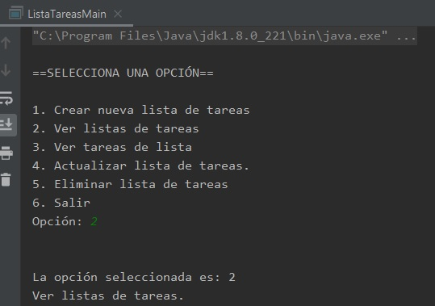

## Postwork 03: Interacción con el usuario.

### OBJETIVO

- Aprender a interactuar con el usuario a través de la entrada recibida desde el teclado.
- Aprender a separar funcionalidades en distintas clases, para estructurad mejor un proyecto.

#### REQUISITOS

1. El avance del postwork de la sesión 02.

#### DESARROLLO

En este postwork reestructurarás el código que has escrito hasta ahora, para organizar mejor cada funcionalidad. 

También deberás agregar una opción nueva al menú, que permita salir de la aplicación.

Además, interactuarás con el usuario a través de las instrucciones recibidas desde el teclado, para que pueda seleccionar una opción del menú.


<details>
        <summary>Solución</summary>
        
1. Crea una nueva clase ***Menu*** que nos ayudará a desplegarlas opciones que el usuario podrá seleccionar. Dentro de esta clase agrega un método **muestraOpciones** y mueve la lista de opciones del método **main** a este nuevo método. Aprovecharemos para agregar una opción que permita salir de la aplicación:

```java
        public class Menu {
            public void muestraOpciones(){
                System.out.println("\n==SELECCIONA UNA OPCIÓN==\n");
                System.out.println("1. Crear nueva lista de tareas");
                System.out.println("2. Ver listas de tareas");
                System.out.println("3. Ver tareas de lista");
                System.out.println("4. Actualizar lista de tareas.");
                System.out.println("5. Eliminar lista de tareas");
                System.out.println("6. Salir");
            }
        }
```
        
2. Agrega una clase **Lector**, similar a la que hicimos en el ejemplo 2, en la que encapsularemos el uso de **Scanner** para leer una opción del teclado, solo que en este leeremos un **byte**, que representará la opción seleccionada por el usuario:

```java
        public class Lector {
            private Scanner scanner = new Scanner(System.in);

            public byte leeOpcion(){
                System.out.print("Opción: ");
                return scanner.nextByte();
            }
        }
```

3. Ahora, crea una clase ***ListasTareas*** y un método para cada una de las opciones del menú, dentro de cada método, en este momento solo es necesario mostrar un texto que indique el nombre de esa opción; en las siguientes sesiones trabajaremos más con esta clase para implementar las funcionalidades de la aplicación:

```java
        public class ListasTareas {
            public void crearNuevaLista(){
                System.out.println("Crear nueva lista de tareas.");
            }

            public void verListaTareas(){
                System.out.println("Ver listas de tareas.");
            }

            public void verTareasDeLista(){
                System.out.println("Ver tareas de lista.");
            }

            public void actualizarListaDeTareas(){
                System.out.println("Actualizar lista de tareas.");
            }

            public void eliminarListaDeTareas(){
                System.out.println("Eliminar lista de tareas.");
            }
        }
```

4. Ahora, reestructura el código del método **main** para usar las nuevas clases que acabas de crear. Lo primero será crear una nueva instancia de cada una de las clases, e inicializaremos la variable **opcionSeleccionada** a **0**:

```java
        Menu menu = new Menu();
        Lector lector = new Lector();
        ListasTareas lista = new ListasTareas();
        byte opcionSeleccionada = 0;
```

5. Mostraremos el menú de opciones y leeremos la opción seleccionada por el usuario, dentro de un bloque **do...while** con el objetivo de permitir al usuario seleccionar distintas opciones sin tener que reiniciar la aplicación. Solo en el caso que se seleccione la opción **6** (salir) se terminará la ejecución de la aplicación. Mantén el bloque switch para elegir la acción correspondiente dependiendo de la opción seleccionada, pero usa la instancia de **ListasTareas** en vez de una cadena de texto:

```java
        do {
            menu.muestraOpciones();
            opcionSeleccionada = lector.leeOpcion();

            System.out.println("\n\nLa opción seleccionada es: " + opcionSeleccionada);

            switch (opcionSeleccionada) {
                case 1:
                    lista.crearNuevaLista();
                    break;
                case 2:
                    lista.verListaTareas();
                    break;
                case 3:
                    lista.verTareasDeLista();
                    break;
                case 4:
                    lista.actualizarListaDeTareas();
                    break;
                case 5:
                    lista.eliminarListaDeTareas();
                    break;
                case 6:
                    System.out.println("Saliendo de la aplicación.");
                    break;
                default:
                    System.out.println("Opción desconocida.");
            }

        }while(opcionSeleccionada != 6);
```

6. Ejecuta la aplicación y comprueba que funciona correctamente.


</details>


