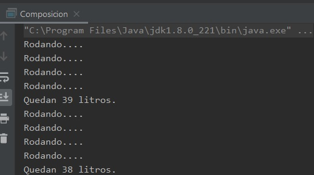

## Reto 02: Clase Vehiculo y composición de clases

### OBJETIVO 

- Practicar la creación de clases compuestas por otras clases.
- Comenzar a pensar en la mejor forma de diseñar nuestras clases para cumplir un objetivo específico.

#### REQUISITOS 

1. Tener instalada la última versión del JDK 8.
2. Tener instalada la última versión de IntelliJ IDEA Community

#### DESARROLLO

- Crea una nueva clase llamada ***Vehiculo***. Cada una de las llantas y el combustible deben estar representadas por una clase.
- El **Combustible** debe poder tener una cantidad de litros máximos y una de litros actuales, además cada vez que se use se debe gastar un litro y debe mostrar la cantidad de litros que quedan.
- Las llantas deben tener un ancho, presión y diámetro. Además, deben poder rodar (mostrando un mensaje que indique que están rodando).
- El vehículo debe tener la capacidad de que se le coloquen las cuatro llantas y el combustible, además de avanzar (rodando las llantas y usando el combustible), sino hay combustible el auto no debe poder avanzar.
- Todos los atributos de todas las clases deben poder leerse y escribirse con métodos de la clase (*getter* y *setter*).
- En el método **main** haz uso del vehículo para avanzar al menos 10 kilómetros.

<details>
	<summary>Solución</summary>
	
1. En el IDE IntelliJ IDEA, crea un nuevo proyecto llamado **Composición**.

2. Dentro del proyecto crea un nuevo paquete llamado **org.bedu.java.jse.basico.sesion3.reto2**.
 
3. Dentro del paquete anterior crea una nueva clase llamada ***Composicion*** y dentro de esta un método ***main***.

4. Crea una clase ***Combustible*** que tenga dos atributos numéricos, uno para el número máximo de litros y otro para el número actual de litros. Además de los atributos, escribe métodos que permitan leer el valor actual de estas propiedades, y también que permitan cambiar su valor; a estos métodos se les conoce con nombre de *getters* y *setters*, de esta forma:

```java
	public class Combustible {
	    private short litrosMaximos;
	    private short litrosActuales;

	    public short getLitrosMaximos() {
		return litrosMaximos;
	    }

	    public void setLitrosMaximos(short litrosMaximos) {
		this.litrosMaximos = litrosMaximos;
	    }

	    public short getLitrosActuales() {
		return litrosActuales;
	    }

	    public void setLitrosActuales(short litrosActuales) {
		this.litrosActuales = litrosActuales;
	    }
	}
```

5. Agrega un método que permita usar el combustible, reduciéndolo y mostrando la cantidad restante:

```java	    
	public void usa(){
        	litrosActuales--;
        	System.out.println("Quedan " + litrosActuales + " litros.");
    	}
```

6. Ahora, crea una clase ***Llanta***, que tenga tres atributos numéricos: ancho, diámetro y presión, junto con sus correspondientes *getters* y *setters*, de la siguiente forma:

```java
	public class Llanta {
	    private float ancho;
	    private float diametro;
	    private float presion;

	    public float getAncho() {
		return ancho;
	    }

	    public void setAncho(float ancho) {
		this.ancho = ancho;
	    }

	    public float getDiametro() {
		return diametro;
	    }

	    public void setDiametro(float diametro) {
		this.diametro = diametro;
	    }

	    public float getPresion() {
		return presion;
	    }

	    public void setPresion(float presion) {
		this.presion = presion;
	    }
	}
```

7. Agrega un método para permitirle rodar; puesto que no hay ningún requerimiento especial para esto, puedes solo mostrar un mensaje que indique que está rodando. 

```java
    public void rueda(){
        System.out.println("Rodando.... ");
    }
```

8. Lo siguiente es crear la clase ***Vehiculo***, la cual tendrá como atributos las cuatro llantas y el combustible. Para el caso del combustible, simplemente declararemos un atributo de este tipo, para las llantas usaremos un arreglo de estas

```java
	public class Vehiculo {
    		private Llanta[] llantas = new Llanta[4];
    		private Combustible combustible = new Combustible();
	}
```
9. Ahora, agrega los métodos correspondientes para establecer las cuatro llantas y el combustible, agrega también un método para llenar el tanque:

```java
    public void setCombustible(Combustible combustible) {
        this.combustible = combustible;
    }

    public void colocaLlantas(Llanta delanteraIzquierda, Llanta delanteraDerecha, Llanta traseraIzquierda, Llanta traseraDerecha) {
        llantas[0] = delanteraIzquierda;
        llantas[1] = delanteraDerecha;
        llantas[2] = traseraIzquierda;
        llantas[3] = traseraDerecha;
    }

    public void llenaTanque() {
        combustible.setLitrosActuales(combustible.getLitrosMaximos());
    }
``` 

10. Finalmente, crea un método que permita avanzar al vehículo, lo primero que hay que hacer es validar si el vehículo tiene combustible, en caso contrario no deberá avanzar; si tiene combustible, deberá mover cada una de las cuatro ruedas y usar el combustible:

```java
	public void avanza() {
		if (combustible.getLitrosActuales() > 0) {
		    for (Llanta llanta : llantas) {
			llanta.rueda();
		    }
		    combustible.usa();
		} else {
		    System.out.println("No hay combustible");
		}
	}
```

11. Para terminar, ahora hay que crear instancias de estas clases y establecer los valores de sus atributos. Los valores que decidas usar no son relevantes en este momento, así que crea 4 llantas y el combustible:

```java
        Llanta llanta1 = new Llanta();
        llanta1.setAncho(205);
        llanta1.setDiametro(16);
        llanta1.setPresion(35);

        Llanta llanta2 = new Llanta();
        llanta1.setAncho(205);
        llanta1.setDiametro(16);
        llanta1.setPresion(35);

        Llanta llanta3 = new Llanta();
        llanta1.setAncho(205);
        llanta1.setDiametro(16);
        llanta1.setPresion(35);

        Llanta llanta4 = new Llanta();
        llanta1.setAncho(205);
        llanta1.setDiametro(16);
        llanta1.setPresion(35);

        Combustible combustible = new Combustible();
        combustible.setLitrosActuales((short) 0);
        combustible.setLitrosMaximos((short) 40);
```

12. Ahora, crea una nueva instancia de vehículo, establece las llantas y el combustible, y posteriormente llena el tanque de combustible:

```java
	Vehiculo vehiculo = new Vehiculo();
        vehiculo.setCombustible(combustible);
        vehiculo.colocaLlantas(llanta1, llanta2, llanta3, llanta4);
        vehiculo.llenaTanque();
```

13. Para terminar, crea un ciclo en el que avance el vehículo:

```java
        for (int i = 1; i <= 10; i++) {
            vehiculo.avanza();
        }
```




</details> 


