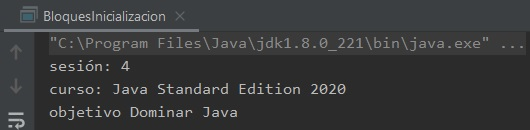

## Ejemplo 01: Bloques de inicialización

### OBJETIVO

- Practicar el uso de bloques de inicialización en Java.
- Comprender que se pueden tener múltiples bloques de inicialización para una misma clase y el orden en el que estos se ejecutan.

#### REQUISITOS

1. Tener instalada la última versión del JDK 8.
2. Tener instalada la última versión de IntelliJ IDEA Community


#### DESARROLLO

1. En el IDE IntelliJ IDEA, crea un nuevo proyecto llamado ***Bloques***.

2. Dentro del proyecto crea un nuevo paquete llamado **org.bedu.java.jse.basico.sesion4.ejemplo1**.

3. Dentro del paquete anterior crea una nueva clase llamada **BloquesInicializacion** y dentro de esta un método **main**.

4. Crea una nueva clase llamada ***Alumno***, esta será la que nos ayude a validar el funcionamiento de los bloques de inicialización. 

5. Dentro de `Alumno` declara tres variables: `curso`, `objetivo` y `sesion`; las dos primeras de tipo `String` y la última de tipo `byte`:

```java
	private String curso;
    	private byte sesion;
    	private String objetivo;
```

6. Ahora, agrega los *getters* correspondientes para cada una de estos atributos:

```java
    public String getCurso() {
        return curso;
    }

    public byte getSesion() {
        return sesion;
    }

    public String getObjetivo() {
        return objetivo;
    }
```

7. Lo siguiente será agregar un bloque de inicialización, en el que estableceremos el estado (valor) de estas variables, de la siguiente forma:

```java
    {
        curso = "Java Standard edition";
        sesion = 4;
        objetivo = "Dominar Java";
    }
```

la clase **Alumno** debe estar de la siguiente forma:

```java
        public class Alumno {
	    private String curso;
	    private byte sesion;
	    private String objetivo;

	    {
		curso = "Java Standard edition";
		sesion = 4;
		objetivo = "Dominar Java";
	    }

	   /* {
		curso = "Java Standard Edition 2020";
	    }*/

	    public String getCurso() {
		return curso;
	    }

	    public byte getSesion() {
		return sesion;
	    }

	    public String getObjetivo() {
		return objetivo;
	    }
	}

```

8. Ahora, en el método `main` de la clase `BloquesInicializacion` crea una nueva instancia de *Alumno*:

```java
	Alumno alumno = new Alumno();
```

9. A continuación, imprime los valores de cada una de las variables:

```java
	System.out.println("sesión: " + alumno.getSesion());
        System.out.println("curso: " + alumno.getCurso());
        System.out.println("objetivo " + alumno.getObjetivo());
```

10. Ejecuta la aplicación, con lo que debes obtener una salida similar a la siguiente:


11. Ahora, haremos una pequeña modificación. Nuevamente en la clase `Alumno`, agrega un nuevo bloque de inicialización debajo del primero, de la siguiente forma:

```java
    {
        curso = "Java Standard edition";
        sesion = 4;
        objetivo = "Dominar Java";
    }

    {
        curso = "Java Standard Edition 2020";
    }
```

12. Ejecuta nuevamente la aplicación, en esta ocasión la salida debe ser similar a la siguiente:



como podemos ver, en el segundo bloque se sobrescribe el valor que se había establecido en el primero, para la variable **curso**. ¿Qué crees que ocurra si invertimos el orden de los bloques de inicialización? de la siguiente forma:

```java
    {
        curso = "Java Standard Edition 2020";
    }
    
    {
        curso = "Java Standard edition";
        sesion = 4;
        objetivo = "Dominar Java";
    }
``` 

13. Ejecuta la aplicación para comprobarlo:


con esto podemos comprobar que los bloques de inicialización se ejecutan en el orden en el que se encuentran dentro de nuestra clase.

!Felicidades¡ acabas de aprender una forma de inicializar el estado de las variables dentro de una clase.
