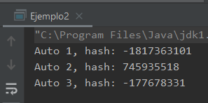

## Ejemplo 02: Método hashCode

### OBJETIVO

- Lo que esperamos que el alumno aprenda

#### REQUISITOS

1. Tener instalada la última versión del JDK 8.
2. Tener instalada la última versión de IntelliJ IDEA Community

#### DESARROLLO

1. En el IDE IntelliJ IDEA, crea un nuevo proyecto llamado **ejemplo2**.

2. Dentro del proyecto crea un nuevo paquete llamado **org.bedu.java.jse.basico.sesion4.ejemplo2**.

3. Dentro del paquete anterior crea una nueva clase llamada **Ejemplo2** y dentro de esta un método **main**.

4. Crea una clase **Automovil** que tenga los siguientes atributos: marca, modelo, año de fabricación y kilometraje; los dos primeros de tipo `String` y los dos últimos de tipo numérico:

```java
    public class Automovil {
        private String marca;
        private String modelo;
        private int anioFabricacion;
        private int kilometraje;
    }
```
 
5. Agrega un constructor que reciba un parámetro por cada uno de los tipos atributos de `Automovil`:

```java
    public Automovil(String marca, String modelo, int anioFabricacion, int kilometraje) {
        this.marca = marca;
        this.modelo = modelo;
        this.anioFabricacion = anioFabricacion;
        this.kilometraje = kilometraje;
    }
```

6. Ahora, sobrescribiremos el método **hashCode**. Lo primero que debemos hacer es declararlo y colocarle la anotación **@Override**, la cual indica al compilador que tenemos la intención de sobrescribir dicho método:

```java
    @Override
    public int hashCode() {
    }
```

7. Posteriormente, en el cuerpo de `hashCode` colocaremos una variable local llamada **hash** que inicializamos con el valor **0**. Será esta variable donde coloquemos el valor final del hash que el método regresará:

```java
    int hash = 0;
```

8. Aunque existen muchas formas de implementar el método **hashCode**, pero una regla general es que usemos los atributos relevantes de la instancia y hacer una operación con ellos (suma, multiplicación, o combinaciones de estos). En este caso usaremos todos los atributos. Cuando tenemos objetos, podemos aprovechar su propio método **hashCode**, de la siguiente forma:

```java
    @Override
    public int hashCode() {
        int hash = 0;
        hash = marca.hashCode();
        hash = hash + modelo.hashCode();
        hash = hash + anioFabricacion;
        hash = hash + kilometraje;
        return hash;
    }
```

9. En el método `main`, inicializamos tres instancias de `Automovil`, cada una con distintos valores para sus atributos:

```java
        Automovil auto1 = new Automovil("Ford", "Shelby", 1965, 25000);
        Automovil auto2 = new Automovil("Bugatti", "Veyron Bleu Centenaire", 2009, 10000);
        Automovil auto3 = new Automovil("Ferrari", "335 Spider Scaglietti", 1957, 12000);
```

10. Finalmente, muestra el hashCode de cada auto. Si usaste los mismos valores que en el ejemplo, el número obtenido también debe ser igual al proporcionado:

```java
        System.out.println("Auto 1, hash: " + auto1.hashCode());
        System.out.println("Auto 2, hash: " + auto2.hashCode());
        System.out.println("Auto 3, hash: " + auto3.hashCode());
```




