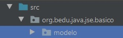

## Postwork 04: Inicialización de listas.

### OBJETIVO

- Aplicar el uso de constructores para la creación e inicialización de tareas y listas de tareas.

#### REQUISITOS

1. El avance del postwork de la sesión 03.

#### DESARROLLO

En este postwork crearás dos nuevas clases, **Tareas** y **ListaTareas**, que posteriormente se agruparán en una serie de colecciones.

En cada una de estas nuevas clases agregarás constructores y bloques de inicialización para indicar el nombre de la tarea o lista de tareas y su fecha de creación.

<details>
        <summary>Solución</summary>
        
1. Dentro de tu proyecto, crea un nuevo sub-paquete llamado **modelo**.



2. En este paquete crea una nueva clase llamada **Tarea** y colócale los siguientes atributos, con sus correspondientes *getters* y *setters*:

```java
    private String nombre;
    private LocalDate fechaCreacion;
    private LocalDate fechaExpiracion;
    private boolean realizada;
    private LocalDate fechaRealizacion;
```

3. Cada tarea tendrá un nombre, y una tarea no puede existir si no se le asigna el nombre; este nombre deberá ser proporcionado por el usuario. Por lo tanto, agrega un constructor que reciba como parámetro del nombre de la tarea:

```java
    public Tarea(String nombre) {
        this.nombre = nombre;
    }
```

4. Cada tarea debe tener también una fecha de creación, sin embargo, dicha fecha será obtenida de forma automática por el sistema al momento de crear la tarea, y por lo tanto esta puede ser inicializada en un bloque de inicialización:

```java
    {
        fechaCreacion = LocalDate.now();
    }
```

5. Para terminar con  `Tarea`, sobrescribe sus métodos `equals` y `hashCode`, de forma que sólo se use el nombre.

6. Ahora crea una nueva clase llamada **ListaTareas**, con los siguientes atributos y sus correspondientes *getters* y *setters*:

```java
    private String nombre;
    private LocalDate fechaCreacion;
```

7. Para esta clase, igual que con la anterior, agrega un constructor que reciba como parámetro el nombre de la lista, y un bloque de inicialización que establezca la fecha de creación:

```java
    {
        fechaCreacion = LocalDate.now();
    }

    public ListaTareas(String nombre) {
        this.nombre = nombre;
    }
```

Esto es todo en este postwork, en el siguiente afinaremos un poco más los detalles de las clases que se han creado hasta el momento.

</details>
