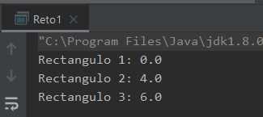

## Reto 01: Constructores

### OBJETIVO 

- Practicar la creación de distintos constructores en una clase.

#### REQUISITOS 

1. Tener instalada la última versión del JDK 8.
2. Tener instalada la última versión de IntelliJ IDEA Community


#### DESARROLLO

- Crea una clase ***Rectangulo*** con dos atributos, alto y ancho, ambos de tipo double.
- **Rectangulo** Deberá tener tres constructores sobrecargados:
	- el primero, sin parámetros; el **alto** y el **ancho** deben inicializarse con el valor de **0**. Este constructor debe tener sólo una línea.
	- el segundo debe tener sólo un número como parámetro, el **alto** y el **ancho** deben inicializarse a ese número. Este constructor debe tener sólo una línea.
	- el tercero debe tener dos números como parámetros, los dos números deben inicializar el ***alto*** y el ***ancho*** respectivamente.
- Agregar un método en la clase rectángulo que calcule el área y probarlo con los siguientes valores:
	- 0 * 0 = 0
	- 2 * 2 = 4
	- 3 * 2 = 6

<details>
	<summary>Solución</summary>

1. En el IDE IntelliJ IDEA, crea un nuevo proyecto llamado ***Reto1***.

2. Dentro del proyecto crea un nuevo paquete llamado **org.bedu.java.jse.basico.sesion4.reto1**.

3. Dentro del paquete anterior crea una nueva clase llamada **Reto1** y dentro de esta un método **main**.

4. Crea una clase **Rectangulo** y dentro de este los dos atributos de tipo ***double***:

```java
	public class Rectangulo {
		private double alto;
		private double ancho;
	}
```
5. Agrega un constructor que reciba los dos parámetros y asígnalos a las variables correspondientes. Como no hay ninguna restricción del número de líneas de este constructor, podemos asignar aquí ambas variables de la siguiente forma:

```java
    public Rectangulo(double alto, double ancho) {
        this.alto = alto;
        this.ancho = ancho;
    }
```

6. Agrega el siguiente constructor, el cual recibirá un solo parámetro con el que inicializará ambos valores. En este caso, para realizar la inicialización usaremos el constructor anterior:

```java
    public Rectangulo(double lados) {
        this(lados, lados);
    }
```

7. Finalmente, crea un constructor sin parámetros. Para inicializar ambos atributos a **0** puedes usar cualquiera de los dos constructores anteriores:

```java
    public Rectangulo() {
        this(0);
    }
```

8. Agrega el método para realizar el cálculo del área:

```java
    public double calculaArea(){
        return alto * ancho;
    }
```

9. Ahora, en el método `main`, crea tres instancias de la clase `Rectangulo`, usando los constructores correspondientes para pasar los valores según las instrucciones al inicio del reto:

```java
        Rectangulo rectangulo1 = new Rectangulo();
        Rectangulo rectangulo2 = new Rectangulo(2);
        Rectangulo rectangulo3 = new Rectangulo(3, 2);
```

10. Imprime los valores del área de cada uno de los rectángulos:

```java
	System.out.println("Rectangulo 1: " + rectangulo1.calculaArea());
        System.out.println("Rectangulo 2: " + rectangulo2.calculaArea());
        System.out.println("Rectangulo 3: " + rectangulo3.calculaArea());
```

11. Ejecuta la aplicación y comprueba que los resultados sean los esperados:




</details> 


