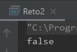

## Reto 02: Método equals

### OBJETIVO 

- Aprender a sobrescribir el método equals

#### REQUISITOS 

1. Tener instalada la última versión del JDK 8.
2. Tener instalada la última versión de IntelliJ IDEA Community

#### DESARROLLO

En este reto, sobrescribirás los métodos para las clases creadas en el reto 2 de la sesión 3: `Combustible`, `Llanta` y `Vehiculo`.

En cada una de las clases deberás revisar:

- Si los dos objetos comparados son el mismo (==), entonces sabemos que son iguales.
- Si el objeto que se compara es nulo, o es de una clase distinta, entonces sabemos que los objetos son iguales.
- Si ninguna de las dos condiciones anteriores se cumple, debemos comparar los valores de todos sus atributos, si todos son iguales podemos decir que los dos objetos son iguales.

<details>
	<summary>Solución</summary>
	
1. En el IDE IntelliJ IDEA, crea un nuevo proyecto llamado **reto2**.

2. Dentro del proyecto crea un nuevo paquete llamado **org.bedu.java.jse.basico.sesion4.reto2**.

3. Dentro del paquete anterior crea una nueva clase llamada **Reto2** y dentro de esta un método **main**.

4. Copia las clases del `Reto 2` de la `Sesión 3`. Comienza con la clase **Combustible** realizando una sobreescritura de equals como la siguiente:

```java
    @Override
    public boolean equals(Object o) {
        if (this == o) return true;
        if (o == null || getClass() != o.getClass()) return false;

        Combustible that = (Combustible) o;

        if (litrosMaximos != that.litrosMaximos) return false;
        return litrosActuales == that.litrosActuales;
    }
```

en esto caso, estamos comparando al final los valores de los atributos **litrosMaximos** y **litrosActuales**.

5. Continua con la clase **Llanta**, sobrescribiendo `equals` de la siguiente forma:

```java
	    @Override
    public boolean equals(Object o) {
        if (this == o) return true;
        if (o == null || getClass() != o.getClass()) return false;

        Llanta llanta = (Llanta) o;

        if (Float.compare(llanta.ancho, ancho) != 0) return false;
        if (Float.compare(llanta.diametro, diametro) != 0) return false;
        return Float.compare(llanta.presion, presion) == 0;
    }
```

en este caso, estamos usando la función `compare` del wrapper `Float`, pero también puede hacerse directamente la comparación.

6. A continuación, sobrescribe el método de **Vehiculo**, este podría parecer complicado puesto que tenemos un objeto de tipo `Combustible` y un arreglo de 4 `Llanta`s; sin embargo, como ya hemos sobrescrito los métodos de estas clases el trabajo se simplifica mucho, ya que podemos aprovecharlos:

```java
    @Override
    public boolean equals(Object o) {
        if (this == o) return true;
        if (o == null || getClass() != o.getClass()) return false;

        Vehiculo vehiculo = (Vehiculo) o;

        // Probably incorrect - comparing Object[] arrays with Arrays.equals
        if (!Arrays.equals(llantas, vehiculo.llantas)) return false;
        return combustible.equals(vehiculo.combustible);
    }
```

en este caso, en vez de comparar a mano cada una de las llantas, usamos el método **Arrays.equals**, que se encarga de revisar si todos los elementos en ambos arreglos son iguales.

7. Para terminar, en el método **main** hay que crear todos los elementos para la comparación de dos Vehículos, es decir: 8 llantas, 2 combustibles y 2 vehículos, y establecer todos sus valores. Para no complicarlo, haremos que todas las llantas tengan los mismos valores; lo mismo con el combustible.

**Tip:** Si quieres reducir las líneas de código, puedes crear constructores que reciban todos los parámetros y así evitar estar llamando muchos *setters** en el **main**.

```java
     public static void main(String[] args) {
        Llanta llanta1 = new Llanta(205, 16, 35);
        Llanta llanta2 = new Llanta(205, 16, 35);
        Llanta llanta3 = new Llanta(205, 16, 35);
        Llanta llanta4 = new Llanta(205, 16, 35);

        Combustible combustible1 = new Combustible(40, 0);

        Vehiculo vehiculo1 = new Vehiculo(combustible1);
        vehiculo1.colocaLlantas(llanta1, llanta2, llanta3, llanta4);
        vehiculo1.llenaTanque();


        Llanta llanta5 = new Llanta(205, 16, 35);
        Llanta llanta6 = new Llanta(205, 16, 35);
        Llanta llanta7 = new Llanta(205, 16, 35);
        Llanta llanta8 = new Llanta(205, 16, 35);

        Combustible combustible2 = new Combustible(40, 0);

        Vehiculo vehiculo2 = new Vehiculo(combustible2);
        vehiculo2.colocaLlantas(llanta5, llanta6, llanta7, llanta8);
        vehiculo2.llenaTanque();

        System.out.println(vehiculo1.equals(vehiculo2));
    }
```

8. Ejecuta el código anterior, el resultado debe ser que ambos objetos son iguales. 


9. Para comprobar que todo está bien implementado, realiza la modificación de algún valor, por ejemplo: no llenando el tanque de alguno de los vehículos, o cambiando la presión de alguna de las llantas. Con cualquier cambio, el resultado debe ser que los objetos no son iguales:



</details> 


