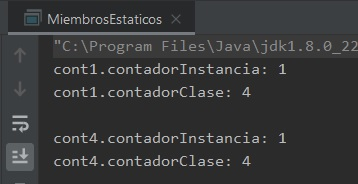
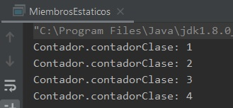

## Ejemplo 01: Atributos estáticos

### OBJETIVO

- Aprender acerca de la declaración de miembros estáticos o de clase.
- Aprender a usar miembros estáticos para mejorar la legibilidad y diseño de una clase.

#### REQUISITOS

1. Tener instalada la última versión del JDK 8.
2. Tener instalada la última versión de IntelliJ IDEA Community.

#### DESARROLLO

En este ejemplo crearemos un conjunto de miembros estáticos dentro de una clase, así como las formas que tenemos de acceder a ellos.

1. En el IDE IntelliJ IDEA, crea un nuevo proyecto llamado **MiembrosEstaticos**.

2. Dentro del proyecto crea un nuevo paquete llamado **org.bedu.java.jse.basico.sesion5.ejemplo1**.

3. Dentro del paquete anterior crea una nueva clase llamada **MiembrosEstaticos** y dentro de esta un método **main**.

4. Crea una nueva clase llamada **Contador**.

```java
	public class Contador {
	
	}
```

5. Dentro de la clase anterior declara dos variables de tipo **short**, la primera será una variable estática llamada **contadorClase** y la otra será una variable de instancia llamada **contadorInstancia**. Agregamos además sus correspondientes *getters* (sólo los *getters*, no necesitaremos los *setters*):

```java
	public class Contador {
		private static short contadorClase;
    		private short contadorInstancia;
		
		public static short getContadorClase() {
        		return contadorClase;
    		}

    		public short getContadorInstancia() {
        		return contadorInstancia;
    		}
	}
```

6. Ahora, dentro del constructor incrementamos el valor de ambas variables:
```java
    public Contador() {
        contadorClase++;
        contadorInstancia++;
    }
```

7. En el método *main*, creamos 4 instancias de contador:

```java
	Contador cont1 = new Contador();
        Contador cont2 = new Contador();
        Contador cont3 = new Contador();
        Contador cont4 = new Contador();
```

8. Y ahora mostramos el valor de las variables **contadorClase** y **contadorInstancia** de ***cont1*** y de **cont4**. Antes de ver el resultado, ¿puedes predecir cuál será la salida?

```java
	System.out.println("cont1.contadorInstancia: " + cont1.getContadorInstancia());
        System.out.println("cont1.contadorClase: " + cont1.getContadorClase());
        System.out.println();
        System.out.println("cont4.contadorInstancia: " + cont4.getContadorInstancia());
        System.out.println("cont4.contadorClase: " + cont4.getContadorClase());
```

9. Al ejecutar el ejemplo anterior, debemos obtener la siguiente salida.



como podemos ver en la imagen anterior, en ambas instancias (la primera y la última) el valor de *contadorInstancia* es 1. Esto quiere decir que la variable se crea dentro de cada instancia nueva e incrementa su valor dentro del constructor, por esta razón el valor siempre será ***1***. También, podemos ver que en ambos casos el valor de *contadorClase* es ***4***. Esto es porque ambas instancias (de hecho, todas las instancias) comparten la misma variable; esto es porque la variable pertenece a la clase y no a una instancia en particular. Haremos dos modificaciones al código para comprobar esto.

10. En las últimas líneas de código que agregamos (las sentencias `System.out.println`), estamos invocando al método `getContadorClase()` en cada una de las instancias. Aunque esto es permitido (compila) no es una práctica recomendada ya que puede causar confusión. Lo recomendable es invocar el método directo de la clase, de la siguiente forma:

```java
	System.out.println("cont1.contadorClase: " + cont1.getContadorClase());
```
cambia a:

```java
	System.out.println("Contador.contadorClase: " + Contador.getContadorClase());
```

y

```java
	System.out.println("cont4.contadorClase: " + cont4.getContadorClase());
```
también cambia a:
```java
	System.out.println("Contador.contadorClase: " + Contador.getContadorClase());
```

Las sentencias anteriores quedan de la siguiente forma:
```java
	System.out.println("cont1.contadorInstancia: " + cont1.getContadorInstancia());
        System.out.println("Contador.contadorClase: " + Contador.getContadorClase());
        System.out.println();
        System.out.println("cont4.contadorInstancia: " + cont4.getContadorInstancia());
        System.out.println("Contador.contadorClase: " + Contador.getContadorClase());
```

la salida de la aplicación debe ser exactamente la misma que la anterior.

11. Haremos una última modificación para comprobar que todas las instancias comparten la misma variable. Después de crear una nueva instancia de tipo `Contador` mostraremos el valor de *contadorClase*, y debemos ver como se incrementa con cada nueva instancia, de la siguiente forma:

```java
	Contador cont1 = new Contador();
        System.out.println("Contador.contadorClase: " + Contador.getContadorClase());

        Contador cont2 = new Contador();
        System.out.println("Contador.contadorClase: " + Contador.getContadorClase());

        Contador cont3 = new Contador();
        System.out.println("Contador.contadorClase: " + Contador.getContadorClase());

        Contador cont4 = new Contador();
        System.out.println("Contador.contadorClase: " + Contador.getContadorClase());
```

12. Al ejecutar la aplicación debemos obtener la siguiente salida:



