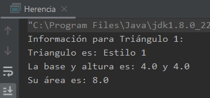

## Ejemplo 2: Herencia

### OBJETIVO

- Aplicar las bases de la herencia, creando una clase base para posteriormente extenderla.

#### REQUISITOS

1. Tener instalada la última versión del JDK 8.
2. Tener instalada la última versión de IntelliJ IDEA Community.


#### DESARROLLO

1. En el IDE IntelliJ IDEA, crea un nuevo proyecto llamado **Herencia**.

2. Dentro del proyecto crea un nuevo paquete llamado **org.bedu.java.jse.basico.sesion5.ejemplo2**.

3. Dentro del paquete anterior crea una nueva clase llamada **Herencia** y dentro de esta un método **main**.

4. Crea una nueva clase llamada **FiguraPlana**; esta será la clase base. Dentro de esta clase, declara dos atributos de tipo **double**: ***base*** y ***altura***, con sus correspondientes *getters**:

```java
public class FiguraPlana {
    private final double base;
    private final double altura;

    public double getBase() {
        return base;
    }

    public double getAltura() {
        return altura;
    }
}
```

5. Agrega un constructor que reciba ambos parámetros para que de esta forma puedan ser inicializados.

```java
    public FiguraPlana(double base, double altura) {
        this.base = base;
        this.altura = altura;
    }
```

6. Finalmente, agrega un método para mostrar los dos valores anteriores:
```java
    void mostrarDimension() {
        System.out.println("La base y altura es: " + base + " y " + altura);
    }
```

7. Ahora, agrega una nueva clase llamada **Triangulo** que extienda de **FiguraPlana** y tenga un atributo tipo `String` llamado **estilo**:

```java
public class Triangulo extends FiguraPlana {
    private final String estilo;
}
	
```

8. Agrega un constructor que reciba tres parámetros, los dos primeros serán la base y la altura, las cuales debe pasar al constructor de **FiguraPlana**, y el **estilo** que debe inicializarse en este constructor. Para hacer referencia al constructor de una clase base, usamos la palabra reservada **super**:

```java
    public Triangulo(double base, double altura, String estilo) {
        super(base, altura);
        this.estilo = estilo;
    }
```

9. Ahora, agregamos dos métodos más, uno que permita calcular el área del triángulo y otro que muestre su estilo

```java
    public double area() {
        return getBase() * getAltura() / 2;
    }

    public void mostrarEstilo() {
        System.out.println("Triangulo es: " + estilo);
    }
```

10. En el método `main` creamos un nuevo triángulo y posteriormente mostramos su estilo, dimensiones y realizamos el cálculo de su área:

```java
	Triangulo triangulo1 = new Triangulo(4.0, 4.0, "Estilo 1");
        System.out.println("Información para Triángulo 1: ");
        triangulo1.mostrarEstilo();
        triangulo1.mostrarDimension();
        System.out.println("Su área es: " + triangulo1.area());
```

11. Al ejecutar la aplicación, la salida debe ser la siguiente:




