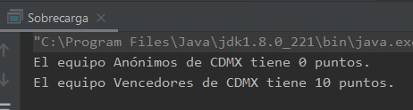

## Ejemplo 03: Sobrecarga de métodos.

### OBJETIVO

- Aprender cómo se realiza la sobrecarga de métodos y constructores.

#### REQUISITOS

1. Tener instalada la última versión del JDK 8.
2. Tener instalada la última versión de IntelliJ IDEA Community.


#### DESARROLLO

1. En el IDE IntelliJ IDEA, crea un nuevo proyecto llamado **Sobrecarga**.

2. Dentro del proyecto crea un nuevo paquete llamado **org.bedu.java.jse.basico.sesion5.ejemplo3**.

3. Dentro del paquete anterior crea una nueva clase llamada **Sobrecarga** y dentro de esta un método **main**.

4. Creamos una nueva clase llamada **Equipo** con tres atributos, ***nombre***, ***ciudad*** y ***puntos***, con sus correspondientes *getters*.

```java
public class Equipo {
    private String nombre;
    private String ciudad;
    private int puntos;

    public String getNombre() {
        return nombre;
    }

    public String getCiudad() {
        return ciudad;
    }

    public int getPuntos() {
        return puntos;
    }
}
```

5. Agregamos un constructor que reciba los tres parámetros anteriores:

```java
    public Equipo(String nombre, String ciudad, int puntos) {
        this.nombre = nombre;
        this.ciudad = ciudad;
        this.puntos = puntos;
    }
```

6. Ahora, sobrecargamos el constructor agregando una versión que reciba solo dos parámetros: el nombre del equipo y su ciudad. Este constructor sobrecargado inicializará los puntos a **0** y usará el constructor anterior para establecer el valor de las dos variables que recibe:

```java
    public Equipo(String nombre, String ciudad) {
        this(nombre, ciudad, 0);
    }
```

7. Agregamos un tercer constructor sobrecargado, en esta ocasión sólo recibirá la ciudad e inicializará el nombre del equipo a **Anónimos**:

```java
    public Equipo(String ciudad) {
        this("Anónimos", ciudad);
    }
```

8. Con los constructores anteriores damos flexibilidad a la forma en la que se puede inicializar la clase **Equipo**, siempre estableciendo la ciudad. Ahora, agregaremos un conjunto de métodos sobrecargados que permitirán actualizar los valores del nombre del equipo y sus puntos. Comenzamos con un método que permita actualizar ambos:

```java
    public void actualiza(String nombre, int puntos){
        this.nombre = nombre;
        this.puntos = puntos;
    }
```

9. Ahora, agregamos una versión sobrecargada del método **actualiza** que permita modificar únicamente el nombre:
```java
    public void actualiza(String nombre){
        this.nombre = nombre;
    }
```
10. Para terminar, sobrecargamos el método anterior para modificar únicamente los puntos:
```java
    public void actualiza(int puntos){
        this.puntos = puntos;
    }
```

en la clase **Equipo**, por lo tanto, debe haber tres métodos llamados **actualiza** que reciben un número y tipo distinto de parámetros:

```java
    public void actualiza(String nombre, int puntos){
        this.nombre = nombre;
        this.puntos = puntos;
    }

    public void actualiza(String nombre){
        this.nombre = nombre;
    }

    public void actualiza(int puntos){
        this.puntos = puntos;
    }
```

11. En el método `main` colocamos el siguiente código, el cual crea dos instancias de **Equipo**, cada una con una versión distinta del constructor, y luego modifica los valores de la segunda instancia, usando las versiones sobrecargadas de **actualiza**:

```java
	Equipo equipo1 = new Equipo("Gladiadores", "Valencia", 5);
        Equipo equipo2 = new Equipo("CDMX");

        System.out.println("El equipo " + equipo2.getNombre() + " de " + equipo2.getCiudad() + " tiene " + equipo2.getPuntos() + " puntos.");

        equipo2.actualiza(10);
        equipo2.actualiza("Vencedores");

        System.out.println("El equipo " + equipo2.getNombre() + " de " + equipo2.getCiudad() + " tiene " + equipo2.getPuntos() + " puntos.");
```

12. Ejecutamos la aplicación, y la salida debe ser similar a la siguiente:




