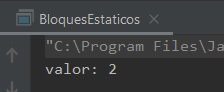

## Reto 01: Bloques estáticos

### OBJETIVO 

- Aprender el correcta declaración, uso y asignación de miembros estáticos.

#### REQUISITOS 

1. Tener instalada la última versión del JDK 8.
2. Tener instalada la última versión de IntelliJ IDEA Community


#### DESARROLLO

En este reto deberás crear una nueva clase con una variable estática llamada valor, la cual deberás declarar de la siguiente forma:

```java
	private static int valor;
```
Realiza las modificaciones necesarias para que te asegures que nadie pueda modificar el valor asignado a la variable `valor`. Esta variable debe inicializarse fuera de cualquier método, estableciendo el valor de tu preferencia.

Posteriormente, debes crear un método que permita mostrar el valor de la variable anterior.

Tu aplicación deberá ejecutarse con el siguiente método *main* (no puedes agregar ni modificar ninguna línea de código a este método):

```java
    public static void main(String[] args) {
        Bloques bloques = new Bloques();

        Bloques.muestaValor();
    }
```

**Nota:** recuerda que los constructores no son considerados métodos.

<details>
	<summary>Solución</summary>
	
1. En el IDE IntelliJ IDEA, crea un nuevo proyecto llamado **BloquesEstaticos**.

2. Dentro del proyecto crea un nuevo paquete llamado **org.bedu.java.jse.basico.sesion5.reto1**.

3. Dentro del paquete anterior crea una nueva clase llamada **BloquesEstaticos** y dentro de esta un método **main**.

4. Dentro del método `main` coloca el código que se encuentra en las instrucciones del reto.

5. De acuerdo con el código, debe haber una clase llamada **Bloques** y dentro de esta la variable **valor** que se encuentra en las instrucciones.

```java
	public class Bloques {
		private static int valor;
	}
```

6. Posteriormente, se indica que se deben realizar modificaciones para asegurar que esta variable no puede cambiar de valor, esto quiere decir que hay que colocarle el modificador **final**.

```java
	private static final int valor;
```

al tener una variable **static final**, esta se convierte en una constante, y recordemos que, de acuerdo con las convenciones de nombres de Java, las constantes deben nombrarse con todas las letras en mayúsculas, por lo que la definición queda de la siguiente forma:

```java
	private static final int VALOR;
```

7. Las instrucciones indican que la variable debe inicializarse. Las constantes sólo pueden inicializarse en dos lugares: constructores y bloques de inicialización. Puesto que `VALOR` es una variable estática, no puede ser inicializada en un constructor, ya que estos últimos pertenecen a las instancias y por lo tanto están en un scope diferente. Así que sólo puede inicializarse por medio de un bloque de inicialización estática:

```java
    static {
        VALOR = 2;
    }
```

8. Finalmente, hay que crear un método que muestre ese valor. En el método `main` vemos que el nombre de ese método debe ser **muestaValor**, que no debe regresar nada ni recibir parámetros.

```java
    public static void muestaValor(){
        System.out.println("valor: " + VALOR);
    }
```

9. Ahora, ejecutamos la aplicación, y debemos tener algo parecido a la siguiente salida:



</details> 

