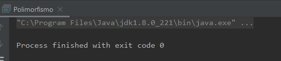
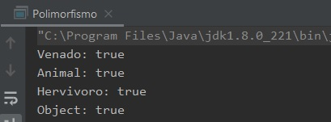

## Ejemplo 01: IS-A

### OBJETIVO

- Aprender cómo aplicar el polimorfismo de tipo en tiempo de ejecución.

#### REQUISITOS

1. Tener instalada la última versión del JDK 8.
2. Tener instalada la última versión de IntelliJ IDEA Community.


#### DESARROLLO

En este ejemplo, crearemos una jerarquía de objetos y veremos cómo en ejecución estos pueden asignarse a distintos tipos de variables.

1. En el IDE IntelliJ IDEA, crea un nuevo proyecto llamado **Polimorfismo**.

2. Dentro del proyecto crea un nuevo paquete llamado **org.bedu.java.jse.basico.sesion6.ejemplo1**.

3. Dentro del paquete anterior crea una nueva clase llamada **Polimorfismo** y dentro de esta un método **main**.

A continuación, crearemos una jerarquía de tres elementos: 1 interface y 2 clases. Ninguna tendrá atributos o métodos ya que no son relevantes en el ejemplo.

4. Crea una nueva interface llamada **Hervivoro**:

```java
public interface Hervivoro {

}
```

5. Ahora, crea una nueva clase abstracta llamada **Animal**

```java
public abstract class Animal {
    
}
```

6. Para terminar, crea una clase llamada **Venado** que extienda **Animal** e implemente **Hervivoro**:

```Java
public class Venado extends Animal implements Hervivoro {
    
}
```

7. Ahora, en el método `main` declara una variable de cada uno de los tipos anteriores, además de una variable de tipo `Object`. Crea una instancia de **Venado** y asígnala a las instancias anteriores:

```java	
        Venado v = new Venado();
        Animal a = v;
        Hervivoro h = v;
        Object o = v;
```
como primera parte del ejemplo, sólo comprobaremos que la aplicación compile:



8. Para terminar, usaremos la instrucción ***instanceof*** la cual nos dice en tiempo de ejecución si un objeto pertenece o hereda (o implementa) de alguna clase o interface. En este caso lo usaremos para validar si **v** puede "comportarse" como un **Animal** o como un **Object**, de la siguiente forma:

```java
        System.out.println("Venado: " + (v instanceof Venado));
        System.out.println("Animal: " + (v instanceof Animal));
        System.out.println("Hervivoro: " + (v instanceof Hervivoro));
        System.out.println("Object: " + (v instanceof Object));
```

9. Al ejecutar la aplicación debemos tener una salida como la siguiente:



10. Si intentamos realizar esta misma prueba con otra clase, no relacionada con `Venado` como, por ejemplo, ***Scanner*** obtendremos un error de compilación que no nos permitirá ejecutar la aplicación:


```java
        System.out.println("Scanner: " + (v instanceof Scanner));
```


