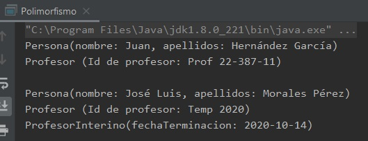

## Ejemplo 02: Super y sobreescritura de métodos.

### OBJETIVO

- Aprender a realizar la sobreescritura de métodos definidos en la clase padre, por uno o más de sus subtipos.
- Aprender a usar la referencia `super` en una subclase, para hacer referencia a elementos de la clase base.

#### REQUISITOS

1. Tener instalada la última versión del JDK 8.
2. Tener instalada la última versión de IntelliJ IDEA Community.

#### DESARROLLO

1. En el IDE IntelliJ IDEA, crea un nuevo proyecto llamado **Polimorfismo**.

2. Dentro del proyecto crea un nuevo paquete llamado **org.bedu.java.jse.basico.sesion6.ejemplo2**.

3. Dentro del paquete anterior crea una nueva clase llamada **Polimorfismo** y dentro de esta un método **main**.

4. Crea una clase **Persona** con dos atributos, **nombre** y **apellidos** y un constructor que reciba estos dos atributos:
```java
	public abstract class Persona {

	    private String nombre;
	    private String apellidos;

	    public Persona(String nombre, String apellidos) {
		this.nombre = nombre;
		this.apellidos = apellidos;
	    }
	}
```
5. Agrega un método llamado **mostrarDatos**, el cual indicará el tipo del objeto y los dos atributos propios de este objeto:
```java
    public void mostrarDatos(){
        System.out.println("Persona(nombre: " + nombre + ", apellidos: " + apellidos + ")");
    }
```

6. Agrega una clase **Profesor** que extienda de `Persona` y agregue un nuevo atributo llamado **idProfesor**, junto con el constructor correspondiente que reciba los valores para inicializar un objeto de tipo **Profesor** y los necesarios para **Persona**; además, debe inicializar los valores de `Persona`:

```java
	public class Profesor extends Persona {

	    private String idProfesor;

	    public Profesor(String nombre, String apellidos, String idProfesor) {
		super(nombre, apellidos);
		this.idProfesor = idProfesor;
	    }
	}
```

7. Sobrescribe el método **mostrarDatos**, de forma que se invoque el método de la clase **Persona** y además los valores de los atributos propios de **Profesor**.
```java
    public void mostrarDatos() {
        super.mostrarDatos();
        System.out.println("Profesor (Id de profesor: " + idProfesor + ")");
    }
```

8. Agrega una última clase llamada **ProfesorInterino** que extienda de **Profesor** y agregue un atributo propio llamado **fechaTerminacion**, junto con el constructor apropiado:
```java
	public class ProfesorInterino extends Profesor {

	    private LocalDate fechaTerminacion;

	    public ProfesorInterino(String nombre, String apellidos, String idProfesor, LocalDate fechaTerminacion) {
		super(nombre, apellidos, idProfesor);
		this.fechaTerminacion = fechaTerminacion;
	    }
	}
```

9. Sobrescribe el método **mostrarDatos**, de forma que se invoque el método de la clase **Profesor** y además los valores de los atributos propios de **ProfesorInterino**.
```java
    public void mostrarDatos() {
        super.mostrarDatos();
        System.out.println("ProfesorInterino(fechaTerminacion: " + fechaTerminacion + ")");
    }
```

10. Finalmente, en el método **main** crea dos variables de referencia de tipo **Profesor**, asigna a la primera un nuevo objeto de tipo **Profesor** y a la segunda un nuevo objeto de tipo **ProfesorInterino**:

```java
        Profesor profesor1 = new Profesor ("Juan", "Hernández García", "Prof 22-387-11");
        Profesor profesor2 = new ProfesorInterino("José Luis", "Morales Pérez", "Temp 2020", LocalDate.of(2020, Month.OCTOBER, 14));
```

11. Invoca el método **mostrarDatos** en cada uno de los objetos, el resultado debe ser similar al siguiente:




