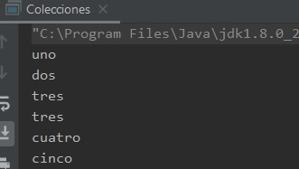
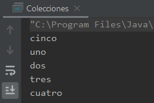
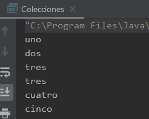
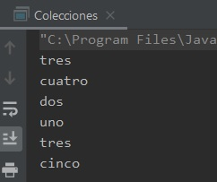
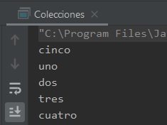

## Ejemplo 03: Uso de colecciones

### OBJETIVO

- Aprender a usar las colecciones `List` y `Set` para agregar y obtener elementos de tipos integrados en Java y de tipos propios.
- Aprender la relación del método `equals` y las colecciones.

#### REQUISITOS

1. Tener instalada la última versión del JDK 8.
2. Tener instalada la última versión de IntelliJ IDEA Community.


#### DESARROLLO

1. En el IDE IntelliJ IDEA, crea un nuevo proyecto llamado **Colecciones**.

2. Dentro del proyecto crea un nuevo paquete llamado **org.bedu.java.jse.basico.sesion6.ejemplo3**.

3. Dentro del paquete anterior crea una nueva clase llamada **Colecciones** y dentro de esta un método **main**.

4. Dentro del método **main** declara una nueva lista de cadenas. Para eso, primero indicaremos que haremos uso de una lista, y le indicaremos que esta lista mantendrá un conjunto de cadenas. El indicar el tipo de objeto ayudará a que el compilador pueda hacer algunas validaciones para asegurar que no introduzcamos objetos de un tipo distinto en la colección:

```java
  List<String> listaCadenas
```

5. Ahora hay que asignar la lista a un tipo concreto de objeto. Recuerda que `List` es una interface y por lo tanto no podemos crear directamente una instancia de ella, sino que debemos usar una clase que implemente dicha interface. Existen diversas implementaciones de `List`, de las cuales hablaremos en la siguiente sesión. En este momento sólo debemos saber que **ArrayList** es una clase que implementa la interface `List`, así que inicializamos la variable anterior a este tipo:

```java
  List<String> listaCadenas = new ArrayList<>();
```
6. Lo siguiente es ingresar valores en la lista. Para eso usamos el método **add** declarado en la interface `List`, el ingresar los objetos en la lista es directo, simplemente pasamos como parámetro el objeto que queremos ingresar. Agregamos los nombres de los números del `uno` al `cinco`; ingresaremos dos veces el número `tres` para hacer una prueba más adelante:
```java
        listaCadenas.add("uno");
        listaCadenas.add("dos");
        listaCadenas.add("tres");
        listaCadenas.add("tres");
        listaCadenas.add("cuatro");
        listaCadenas.add("cinco");
```

7. A continuación, iteraremos o recorreremos la *listaCadenas* para posteriormente extraer cada una de las cadenas que acabamos de ingresar. Hay varias formas de hacer esto, pero lo más común es usar la instrucción ***for***, ya sea la instrucción "normal" o la mejorada. Con el ***for*** normal es necesario obtener primero el número de elementos en la colección, usando el método **size()** y posteriormente obtener el elemento que queremos usando el método **get(i)**, de la siguiente forma:

```java
        for (int i = 0; i < listaCadenas.size(); i++) {
            System.out.println(listaCadenas.get(i));
        }
```
con el ***for*** mejorado ahorramos algunas instrucciones, ya que en automático obtiene el número de elementos y extrae el elemento actual, por lo que el ciclo queda de la siguiente forma:

```java
        for (String cadena : listaCadenas){
            System.out.println(cadena);
        }
```

será esta última forma la que usemos a lo largo del ejemplo.

8. Al ejecutar la aplicación, debemos tener una salida similar a la siguiente:



podemos ver que obtenemos los elementos en el mismo orden en el que los ingresamos a la lista y que vemos los dos números "tres" que ingresamos.

9. Haremos lo mismo para el siguiente tipo de colección: **Set**. El caso de **Set** es muy similar al de **List**, ya que es una interfaz y existen muchas clases que la implementan. Para este ejemplo usaremos ***HashSet*** como implementación:
```java
Set<String> setCadenas = new HashSet<>();
```

10. En este caso también introduciremos los nombres de los números del "uno" al "cinco" e ingresaremos dos veces el número "tres":
```java
        setCadenas.add("uno");
        setCadenas.add("dos");
        setCadenas.add("tres");
        setCadenas.add("tres");
        setCadenas.add("cuatro");
        setCadenas.add("cinco");
```

11. Mostraremos los valores del **Set** usando un ciclo ***for*** mejorado. 
```java
        for (String cadena : setCadenas){
            System.out.println(cadena);
        }
```

12. La salida debe ser similar a la siguiente:



podemos observar dos cosas de esta salida. La primera es que los elementos aparecen en un orden diferente del que los fuimos ingresando en el **Set**, y la segunda es que sólo podemos ver un elemento "tres" y no los dos que ingresamos. Eso es porque los **Set** no admiten elemento repetidos; es por eso por lo que sólo ha quedado un elemento "tres".

13. Veamos cómo hacer esto mismo, pero usando una clase propia. Creamos una nueva clase llamada **Numero** que tendrá una sola propiedad ***nombre***. Proporcionaremos un constructor para inicializar esta propiedad, y un método *getter* para recuperar su valor.
```java
    public class Numero {
        private String nombre;

        public Numero(String nombre) {
            this.nombre = nombre;
        }

        public String getNombre() {
            return nombre;
        }
    }
```

14. En el método **main** declaramos e inicializamos una nueva lista para mantener elementos de tipo **Numero** e ingresamos números del "uno" al "cinco". Nuevamente ingresaremos dos veces el número "tres":
```java
        List<Numero> listaNumeros = new ArrayList<>();
        listaNumeros.add(new Numero("uno"));
        listaNumeros.add(new Numero("dos"));
        listaNumeros.add(new Numero("tres"));
        listaNumeros.add(new Numero("tres"));
        listaNumeros.add(new Numero("cuatro"));
        listaNumeros.add(new Numero("cinco"));
```
15. Mostraremos, en un ciclo **for** los valores de los elementos de la lista; para esto haremos uso del método **getNombre**:
```java
        for (Numero numero : listaNumeros){
            System.out.println(numero.getNombre());
        }
```

16. Al ejecutar la aplicación, debemos obtener una salida similar a la siguiente:



podemos ver que nuevamente los elementos los recuperamos en el mismo orden en el que los ingresamos a la lista.

17. Para terminar, repetiremos lo mismo, pero usando un **Set**:
```java
        Set<Numero> setNumeros = new HashSet<>();
        setNumeros.add(new Numero("uno"));
        setNumeros.add(new Numero("dos"));
        setNumeros.add(new Numero("tres"));
        setNumeros.add(new Numero("tres"));
        setNumeros.add(new Numero("cuatro"));
        setNumeros.add(new Numero("cinco"));
        
        for (Numero numero : setNumeros){
            System.out.println(numero.getNombre());
        }
```

18. Al ejecutar la aplicación, la salida debe ser similar a la siguiente:



podemos ver que nuevamente la salida está en un orden distinto al que usamos para ingresar los elementos. También, podemos ver que ocurrió algo distinto a la última vez, y es que "tres" aparece dos veces en la salida anterior. Esto ocurre porque **Set** hace uso del método **equals** para saber si el objeto ya existe dentro de la colección. En este caso no hemos sobrescrito el método **equals** y, por lo tanto, la colección no tiene forma de saber si ya tiene el elemento. 

19. Para corregir el problema anterior, sobrescribiremos los métodos **equals** y **hashCode** en la clase **Numero**:
```java
    @Override
    public boolean equals(Object o) {
        if (this == o) return true;
        if (o == null || getClass() != o.getClass()) return false;

        Numero numero = (Numero) o;

        return nombre != null ? nombre.equals(numero.nombre) : numero.nombre == null;
    }

    @Override
    public int hashCode() {
        return nombre != null ? nombre.hashCode() : 0;
    }
```

20. Si volvemos a ejecutar la aplicación, ahora la salida debe ser similar a la siguiente, en la que podemos ver que ya solo aparece un elemento "tres":


