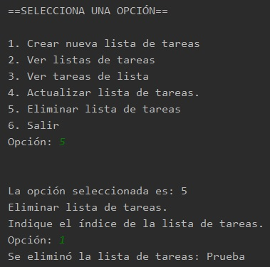

## Postwork 06: Listas de Tareas.

### OBJETIVO

- Manejar objetos propios dentro de listas.
- Aprender a actualizar y eliminar elementos dentro de una lista.
- Hacer uso de lo aprendido en la sesión con respecto al trabajo con el framework Collections.

#### REQUISITOS

1. El avance del postwork de la sesión 05.

#### DESARROLLO

En este postwork comenzarás a usar la clase **java.util.List** para crear nuevas listas de tareas, agregando, recorriendo y eliminando elementos dentro de la misma.

En este postwork trabajaremos con las clases **ListaTareas** y **ListasTareas**.

<details>
        <summary>Solución</summary>
        
1. En la clase **ListaTareas** agrega un nuevo atributo de tipo **List<Tarea>**, este te permitirá mantener agrupadas un conjunto de tareas relacionadas, las cuales pueden ser tareas de una materia, pendientes de un fin de semana, pasos de una receta de cocina, etc.
        
Declara a inicializa esta lista, de la siguiente forma:
```java
        private final List<Tarea> tareas = new ArrayList<>();
```

2. Dentro de esta misma clase, agrega un nuevo método llamado ***agregaTarea***, que permitirá agregar una nueva `Tarea` a la lista anterior; este método no regresará nada, pero recibirá como parámetro la `Tarea` para agregar.
```java
    public void agregaTarea(Tarea tarea){
        tareas.add(tarea);
    }
```

3. Agrega también un método que permita eliminar una `Tarea` de la lista. El método deberá recibir el índice o posición de la `Tarea` que se debe eliminar de la lista. Como es posible que el usuario introduzca un índice mayor al número de elementos en la lista, valida que el índice sea menor al número de elementos de la lista. Si el número es mayor, muestra un mensaje de error y regresa un valor ***null***; si el número es menor elimina el elemento y regresa el elemento eliminado.

```java
    public Tarea eliminaTarea(int indice){
        if(indice > tareas.size()){
            System.out.println("La tarea indicada no se encuentra en la lista.");
            return null;
        }

        return tareas.remove(indice);
    }
```

4. Agrega también un método que permita obtener la lista de tareas (un *getter*) y otro que permita obtener el número de tareas que actualmente están en la lista.

```java
    public List<Tarea> getTareas() {
        return tareas;
    }

    public int numeroTareas(){
        return tareas.size();
    }
```

5. Para terminar, agrega un método que imprima el nombre de todas las tareas que se encuentran en la lista. Este método debe mostrar el índice de la tarea y su nombre. El índice será el valor al que posteriormente hará referencia al usuario para referirse a esa tarea:

```java
    public void muestraTareas(){
        for (int i = 0; i < tareas.size(); i++) {
            System.out.println((i+1) + " - " + tareas.get(i).getNombre());
        }
    }
```

6. En la clase **ListasTareas** será en donde se realicen los mayores cambios y los más interesantes, ya que comenzarás a rellenar los métodos de lógica de la aplicación. En este momento lo único que hacen es mostrar el nombre de la opción seleccionada; sin embargo, ahora comenzarán a crear Listas de tareas.

Lo primero que debes hacer es crear una nueva **List** que se encargará de agrupar **ListaTareas** (las cuales a su vez contendrán `Tarea`s). Declara e inicializa una nueva instancia de esta forma:
```java
        private List<ListaTareas> listasTareas = new ArrayList<>();
```

7. A continuación, modificarás el primer método, **crearNuevaLista**. Este método en este momento sólo muestra el nombre de la opción seleccionada, captura el nombre de la nueva lista de tareas y crea una nueva instancia de **ListaTareas**. Ahora, toma ese objeto y agrégalo a **listasTareas**:
```java
        listasTareas.add(lista);
```

8. A continuación, modificarás el método **verListaTareas** para mostrar el contenido de **listasTareas** y que el usuario será cuántas listas ha creado y el índice de estas, pero antes agrega un método de utilidad que valide si ya existe alguna lista de tareas. Esta es una validación que estarás haciendo de forma constante, por lo que es una buena práctica agregarla dentro de un método que posteriormente puedas invocar.

```java
    private boolean validaExistenciaLista() {
        if (listasTareas == null || listasTareas.isEmpty()) {
            System.out.println("Aún no se ha creado ninguna lista de tareas.");
            return false;
        }
        return true;
    }
```

lo que hace este método es validar si **listasTareas** ha sido inicializado y si no está vacía (si tiene al menos un elemento). Si ninguna de las dos condiciones se cumple, muestra un mensaje indicando que no se ha creado ninguna lista de tareas y luego regresa un valor de **false**, indicando que las validaciones fallaron; si todas las validaciones pasan, entonces regresa un valor **true**.

9. En el método **verListaTareas**, verifica que se tenga al menos una lista de tareas, usando el método que acabas de crear (**validaExistenciaLista**); si no hay ninguna lista de tareas entonces no hay nada que mostrar, por lo tanto, terminaremos la ejecución el método:

```java
        if (!validaExistenciaLista()) {
            return;
        }
```

Si existe al menos una lista de tareas, muestra todos los elementos contenidos en **listasTareas**, indicando su índice y su nombre:
```java
        for (int i = 0; i < listasTareas.size(); i++) {
            System.out.println((i + 1) + " - " + listasTareas.get(i).getNombre());
        }
```

10. A continuación, actualizarás el método **verTareasDeLista**, que mostrará todas las `Tareas` que se encuentren dentro de la lista indicada por el usuario; pero, antes agrega un nuevo método que valide si existe una lista de tareas en el índice seleccionado por el usuario. 

Crea un nuevo método llamado **validaIndice**, el cual validará la entrada capturada por el usuario. Si no existe una lista en el índice seleccionado, mostrará un mensaje de error y regresará el índice ***0*** (con esto sabremos que la validación falló). Si existe algo en el índice, regresará el número ingresado por el usuario. 

```java
    private int validaIndice(){
        byte indice = 0;

        System.out.println("Indique el índice de la lista de tareas.");
        indice = lector.leeOpcion();

        if (indice > listasTareas.size() || indice < 0) {
            System.out.println("No existen listas de tareas en el índice seleccionado.");
            indice = 0;
        }

        return indice;
    }
```

para ahorrar algo de código en los métodos que modificaremos, incluso podemos agregar en **validaIndice** la validación anterior, así sabremos que **validaIndice** valida la existencia de listas y el índice introducido por el usuario:

```java
    private byte validaIndice() {
        byte indice = 0;

        if (!validaExistenciaLista()) {
            return indice;
        }

        System.out.println("Indique el índice de la lista de tareas.");
        indice = lector.leeOpcion();

        if (indice > listasTareas.size() || indice < 0) {
            System.out.println("No existen listas de tareas en el índice seleccionado.");
            indice = 0;
        }

        return indice;
    }
```

11. De regreso en el método **verTareasDeLista**, invoca a **validaIndice**. Si el índice regresado es ***0***, podemos estar seguros de que alguna validación falló y por lo tanto podemos terminar la ejecución del método:
```java
        byte indice = validaIndice();

        if(indice == 0){
            return;
        }
```

12. Si el índice es distinto de ***0*** entonces obtenemos la lista asociada a ese índice. Recuerda que el usuario está introduciendo un valor cuyas opciones inician en ***1***, mientras que el índice de los elementos en una **List** inicia en ***0***; por lo tanto, para no obtener un elemento equivocado, debes restar ***1*** al índice introducido por el usuario al momento de obtener la lista de tareas:
```java
        ListaTareas lista = listasTareas.get(indice - 1);
```
13. Finalmente, agrega una última validación. Si la lista de tareas seleccionada por el usuario no tiene tareas, muestra un mensaje indicándolo. Al final, muestra las tareas contenidas en la lista:
```java
        if (lista.numeroTareas() == 0) {
            System.out.println("Aún no hay tareas en la lista.");
        }

        lista.muestraTareas();
```
14. No harás nada en el método **actualizarListaDeTareas**, salvo agregar la última validación para obtener un índice válido.
```java
    public void actualizarListaDeTareas() {
        System.out.println("Actualizar lista de tareas.");

        byte indice = validaIndice();

        if (indice == 0) {
            return;
        }
    }
```

15. Para terminar, en el método **eliminarListaDeTareas** agrega esta misma validación. Si el índice es válido entonces elimina la **ListaTareas** correspondiente:

```java
    ListaTareas listaEliminada = listasTareas.remove((indice - 1));

    System.out.println("Se eliminó la lista de tareas: " + listaEliminada.getNombre());
```

16. Ejecuta la aplicación y navega entre las opciones, las cuales deben estar funcionando de manera correcta. Ya puedes agregar, ver y eliminar listas de tareas. En la siguiente sesión harás lo mismo, pero con tareas dentro de una lista.




</details>


