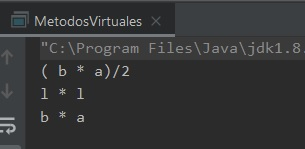

## Reto 02: Métodos virtuales

### OBJETIVO 

- Aprender cómo funciona la selección dinámica o en tiempo de ejecución de los métodos que se usan.

#### REQUISITOS 

1. Tener instalada la última versión del JDK 8.
2. Tener instalada la última versión de IntelliJ IDEA Community.


#### DESARROLLO

En este reto deberás crear una clase base, y un conjunto de clases derivadas que sobrescriban uno de los métodos de la clase base y lograr que dinámicamente se llame el método del tipo correcto de objeto.

- Deberás tener una clase base **Figura** con un método **formulaCalculaArea** que no reciba parámetros ni regrese ningún valor. 
- El método anterior deberá imprimir la fórmula para el cálculo del área de la figura correspondiente.
- En el caso de la clase **Figura** su método no debe tener ninguna funcionalidad.
- Crea las siguientes clases, las cuales deben pasar la prueba IS-A con **Figura**:
	- **Triangulo**
	- **Rectangulo**
	- **Cuadrado**
- Deberás declarar una sola variable en el método **main** y con esa variable deberás comprobar la funcionalidad de las tres clases hija.

<details>
	<summary>Solución</summary>
	
1. En el IDE IntelliJ IDEA, crea un nuevo proyecto llamado **MetodosVirtuales**.

2. Dentro del proyecto crea un nuevo paquete llamado **org.bedu.java.jse.basico.sesion6.reto2**.

3. Dentro del paquete anterior crea una nueva clase llamada **MetodosVirtuales** y dentro de esta un método **main**.

4. Crea una clase llamada **Figura**. Esta clase puede se concreta, pero para tener un mejor diseño la haremos abstracta, esto evitará crear instancias de una clase que no tiene ninguna funcionalidad:

```java
public abstract class Figura {

}
```

5. Dentro de esta clase, declara un método llamado **formulaCalculaArea**, el cual también será abstracto. De esta forma las clases que extiendan de **Figura** se verán obligadas a sobrescribir este método:

```java
	public abstract void formulaCalculaArea();
```

6. Crea una clase **Triangulo** que extienda de **Figura**. Esta clase deberá implementar **formulaCalculaArea**, mostrando la fórmula para calcular el área del triángulo:
```java
	class Triangulo extends Figura{
		@Override
		public void formulaCalculaArea() {
			System.out.println("");
		}
    }
```

7. Crea una clase **Rectangulo**, que también extienda de **Figura** e implemente **formulaCalculaArea**:
```java
class Rectangulo extends Figura{
    @Override
    public void formulaCalculaArea() {
        System.out.println("");
    }
}
```

8. Finalmente, crea una clase **Cuadrado**, la cual puede extender de **Figura** o de **Rectangulo**. En cualquiera de los casos, deberá sobrescribir **formulaCalculaArea**:
```java
class Cuadrado extends Rectangulo{
    @Override
    public void formulaCalculaArea() {
        System.out.println("c");
    }
}
```

9. A continuación, crea una variable de tipo **Figura**; puedes inicializar su valor a `null` o algún otro tipo. Esta será la única variable que ***declaremos*** en la aplicación:
```java
Figura figura = null;
```

10. Asigna a la variable `figura` un nuevo objeto de tipo ***Triangulo**:
```java
figura = new Triangulo();
```

12. Puedes invocar directamente el método **formulaCalculaArea** de la variable **figura**, o puedes aprovechar el polimorfismo de esta clase para hacerlo a través de un método, que recibirá como parámetro un tipo **Figura**, esto ayudará a escribir menos código:
```java
    public static void llamaCalculaArea(Figura figura) {
        figura.formulaCalculaArea();
    }
```

13. Ahora, en el método **main**, llama a este nuevo método pasando como parámetro al objeto **figura**:
```java
llamaCalculaArea(figura);
```

14. Repite esto mismo para los tipos **Cuadrado** y **Rectangulo**:
```java
        figura = new Cuadrado();
        llamaCalculaArea(figura);

        figura = new Rectangulo();
        llamaCalculaArea(figura);
``` 

15. Para terminar, ejecuta la aplicación, la salida debe ser similar a la siguiente:



</details> 


