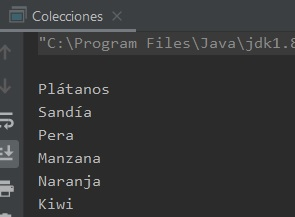
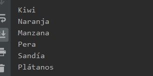
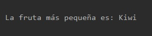
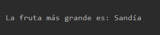
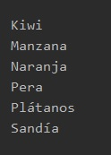
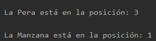
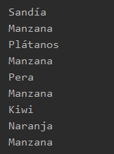
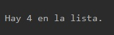

## Reto 03: Collections

### OBJETIVO 

- Aprender a usar la clase **java.util.Collections** para búsquedas y ordenamientos de elementos dentro de una Lista.

#### REQUISITOS 

1. Tener instalada la última versión del JDK 8.
2. Tener instalada la última versión de IntelliJ IDEA Community.

#### DESARROLLO

En este reto usarás la clase **Collections** para realizar búsquedas y ordenamientos en una lista de cadenas.

- Revisa la documentación de la clase Collections (https://docs.oracle.com/javase/8/docs/api/?java/util/Collections.html), de esta forma tendrás una idea de los métodos que podrías usar para llevar a cabo el reto.
- Crea una lista de cadenas llamada **listaFrutas** y llénala con los siguientes elementos:
	- Plátanos
	- Sandía
	- Pera
	- Manzana
	- Naranja
	- Kiwi
	
- Invierte el orden de los elementos de la colección. Esto quiere decir que el `Kiwi` deberá ser el primer elemento en la lista y los `Plátanos` los últimos.
- Busca cuál es el elemento más pequeño, o sea, si los ordenáramos alfabéticamente ¿cuál sería el primer elemento en la lista?
- Busca cuál es el elemento más grande, o sea, si los ordenáramos alfabéticamente ¿cuál sería el último elemento en la lista?
- Ordena la lista alfabéticamente.
- Busca en qué posición de la lista, ya ordenada, están la `Pera` y la `Naranja`.
- Agrega tres `Manzana`s nuevas a la lista.
- Desordena los elementos de la lista, es decir, ordénalos de manera aleatoria en la lista.
- Busca cuántas `Manzana`s hay en la lista.

<details>
	<summary>Solución</summary>
	
1. En el IDE IntelliJ IDEA, crea un nuevo proyecto llamado **Colecciones**.

2. Dentro del proyecto crea un nuevo paquete llamado **org.bedu.java.jse.basico.sesion6.reto3**.

3. Dentro del paquete anterior crea una nueva clase llamada **Colecciones** y dentro de esta un método **main**.
	
4. Como el reto trata de listas de cadenas que representan frutas, lo primero que debes hacer es crear e inicializar esta lista:
```java
	List<String> listaFrutas = new ArrayList<>();
```

también, como para demostrar que se han cumplido cada uno de los elementos del reto tendrás que estar mostrando los valores de la lista, puedes crear un método que reciba la lista e imprima todos sus valores:
```java
    private static void muestraFrutas(List<String> lista){
        System.out.println();
        for (String fruta : lista){
            System.out.println(fruta);
        }
    }
```

esto no es obligatorio, pero simplificará mucho el proceso de imprimir los valores de la lista.

5. El primer punto del reto indica que hay que llenar la lista con ciertos valores. Esto puedes hacerlo de dos formas, la primera es usando el método ***add*** de la interface **List** para agregar cada valor. La segunda forma es usando el método **addAll** de la clase **Collections**, de la siguiente forma:
```java
        Collections.addAll(listaFrutas, "Plátanos", "Sandía", "Pera", "Manzana", "Naranja", "Kiwi");
```

6. Comprueba que todos los elementos están en lista usando el método **muestraFrutas**:



7. El segundo punto indica que deberás voltear los elementos de la lista. Para esto puedes usar el método **reverse** de **Collections**:
```java
        Collections.reverse(listaFrutas);
        muestraFrutas(listaFrutas);
```


8. El tercer punto indica que debes buscar el elemento más pequeño. Para esto, usa el método ***min***:

```java
	System.out.println("\nLa fruta más pequeña es: " + Collections.min(listaFrutas));
```




9. El cuarto punto es similar, pero con el elemento más grande. Para esto, usa el método ***max***:

```java
	System.out.println("\nLa fruta más grande es: " + Collections.max(listaFrutas));
```




10. Para el quinto punto, debes ordenar la lista alfabéticamente. Para esto, usa el método **sort**:
```java
	Collections.sort(listaFrutas);
        muestraFrutas(listaFrutas);
```



11. En el siguiente punto, debes buscar en qué posición de la lista están la `Pera` y la `Manzana`. Usa el método **binarySearch** para encontrarlas. Este método regresará la posición o índice dentro de la lista, el cual inicia en **0**:
```java
        System.out.println("\nLa Pera está en la posición: " + Collections.binarySearch(listaFrutas, "Pera"));
        System.out.println("\nLa Manzana está en la posición: " + Collections.binarySearch(listaFrutas, "Manzana"));
```



12. Para el séptimo punto debes agregar tres `Manzana`s. Esto nuévametne puede hacerse con el método **addAll**:
```java
	Collections.addAll(listaFrutas,"Manzana", "Manzana", "Manzana");
```


13. Para el octavo punto, debes desordenar los elementos de la lista. Para esto usa el método **shuffle**:
```java
	Collections.shuffle(listaFrutas);
        muestraFrutas(listaFrutas);
```



14. Para el último punto debes buscar cuántas `Manzana`s hay en la lista. Para esto, la clase **Collections** proporciona el método **frequency**:
```java
	System.out.println("\nHay " + Collections.frequency(listaFrutas, "Manzana") + " en la lista.");
```



Con esto, has terminado con el reto.

</details> 


