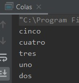
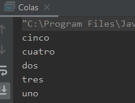
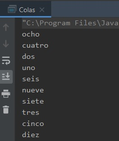

## Ejemplo 01: Uso de colas.

### OBJETIVO

- Aprender el uso de colas de prioridades.
- Aprender el uso de los métodos propios de la interface Queue.
- Implementar colas de prioridades.

#### REQUISITOS

1. Tener instalada la última versión del JDK 8.
2. Tener instalada la última versión de IntelliJ IDEA Community.


#### DESARROLLO

En este ejemplo aprenderás a hacer uso de las colas de prioridad, en el cual se ordenan los elementos en base a un valor determinado para posteriormente poder ser procesados.

1. En el IDE IntelliJ IDEA, crea un nuevo proyecto llamado **Colas**.

2. Dentro del proyecto crea un nuevo paquete llamado **org.bedu.java.jse.basico.sesion7.ejemplo1**.

3. Dentro del paquete anterior crea una nueva clase llamada **Colas** y dentro de esta un método **main**.

4. Dentro del método *main* declara una nueva variable de referencia de tipo **Queue<String>**, en esta variable se mantendrán las cadenas que posteriormente serán procesadas. Inicializa esta variable a un nuevo objeto de tipo **PriorityQueue**:
```java
	Queue<String> cola = new PriorityQueue<>();
```
	
5. Agrega cinco elementos, representando los números del "uno" al "Cinco":
```java
	cola.add("uno");
        cola.add("dos");
        cola.add("tres");
        cola.add("cuatro");
        cola.add("cinco");

```
6. Ahora, recorre el objeto `cola` usando un ciclo ***for***, lo que esperaríamos sería obtener los elementos priorizados al irlos obteniendo de la cola, ya que, en el caso de las cadenas, estas se ordenan de forma ascendente:

```java
        for (String cadena : cola) {
            System.out.println(cadena);
        }
```

7. Al ejecutar la aplicación, obtenemos una salida como la siguiente:



Podemos ver que las cadenas están en un orden distinto al que las insertamos, pero no están en orden alfabético como estábamos esperando.

Lo que ocurre en este caso es que estamos usando los métodos de **Collection** para recorrer la lista, y no los proporcionados por **Queue**. Para obtener los elementos en orden alfabético (su prioridad por default), debemos usar el método **poll** (o el método **remove**), el cual obtiene el elemento con la prioridad más alto y lo elimina de la cola. Para obtener todos los elementos, los colocamos en un ciclo ***while***:

```java
        String valor = null;

        while ( (valor = cola.poll()) != null){
            System.out.println(valor);
        }
```

8. Al ejecutar la aplicación, tenemos la siguiente salida:



podemos ver que en esta ocasión las cadenas las obtenemos en el orden esperado.

Hagamos la misma prueba, pero usando un objeto propio. 

9. Creamos una nueva clase llamada **Libro**, la cual tendrá un **título**, que será una cadena, y una **prioridad** que será un número entero; será por esta última propiedad que daremos la prioridad a los elementos:
```java
	public class Libro {
	    private final String titulo;
	    private int priodidad;

	    public Libro(String titulo, int priodidad) {
		this.titulo = titulo;
		this.priodidad = priodidad;
	    }

	    public String getTitulo() {
		return titulo;
	    }
	}
```

con esto debería ser suficiente; sin embargo, así como cuando trabajamos con **Set** debemos sobrescribir el método **equals** para que la colección sepa si dos objetos son iguales, cuando trabajamos con **PriorityQueue** debemos implementar la interface **Comparable**, la cual permite saber si un objeto debe ir adelante o detrás de otro usando algún criterio. 

Esta interface define un único método: **public int compareTo**, el cual se encarga de comparar el objeto actual contra otro que recibe como parámetro. String y las clases Wrapper implementan esta interfaz, pero nosotros debemos implementarla en nuestras propias clases. Eso es lo que haremos en libro:

10. Implementamos la interface **Comparable**, la cual comparará el valor de los atributos **prioridad** de los libros:
```java
	public class Libro implements Comparable<Libro> {
	    @Override
	    public int compareTo(Libro libro) {
		return this.priodidad - libro.priodidad;
	    }
	}
```

11. En el método **main** declaramos e inicializamos una nueva **PriorityQueue** que trabajará con elementos tipo  **Libro**:
```java
	Queue<Libro> libros = new PriorityQueue<>();
```

12. Después, agregamos 10 objetos **Libro** a la colección. El título no es relevante, pero sí la prioridad. Colocaremos las prioridades al azar, pero nos encargaremos que de que todas sean diferentes:
```java
        libros.add(new Libro("uno", 4));
        libros.add(new Libro("dos", 3));
        libros.add(new Libro("tres", 8));
        libros.add(new Libro("cuatro", 2));
        libros.add(new Libro("cinco", 9));
        libros.add(new Libro("seis", 5));
        libros.add(new Libro("siete", 7));
        libros.add(new Libro("ocho", 1));
        libros.add(new Libro("nueve", 6));
        libros.add(new Libro("diez", 10));
```

13. Extraemos los libros, usando el método **poll**:
```java
        Libro libro = null;

        while ((libro = libros.poll()) != null) {
            System.out.println(libro.getTitulo());
        }
```

14. Al ejecutar la aplicación, debemos obtener los libros en orden de prioridad:




