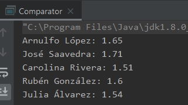

## Ejemplo 02: Comparando personas

### OBJETIVO

- Implementar la interface **Comparable** para realizar el ordenamiento de objetos propios.
- Aprender la forma correcta de comparar valores numéricos.

#### REQUISITOS

1. Tener instalada la última versión del JDK 8.
2. Tener instalada la última versión de IntelliJ IDEA Community.

#### DESARROLLO

En este reto, implementaremos la interface **Comparable** para comparar objetos de tipo **Persona** y ordenarlos por estatura.

1. En el IDE IntelliJ IDEA, crea un nuevo proyecto llamado **Comparable**.

2. Dentro del proyecto crea un nuevo paquete llamado **org.bedu.java.jse.basico.sesion7.ejemplo2**.

3. Dentro del paquete anterior crea una nueva clase llamada **Comparable** y dentro de esta un método **main**.

4. Creamos una clase **Persona** con tres atributos, dos `String` que representen su ***nombre*** y ***apellido*** y un `float` que represente su ***estatura***. Agregamos también el correspondiente constructor y *getters*:
```java
	public class Persona {
	    private final String nombre;
	    private final String apellido;
	    private float estatura;

	    public Persona(String nombre, String apellido, float estatura) {
		this.nombre = nombre;
		this.apellido = apellido;
		this.estatura = estatura;
	    }

	    public String getNombre() {
		return nombre;
	    }

	    public float getEstatura() {
		return estatura;
	    }
	}
```
5. Haremos que **Persona** implemente la interface **Comparable**:

```java
	public class Persona implements Comparable<Persona> {
		@Override
		public int compareTo(Persona persona) {
		
		}
	}
```

6. En ejemplos anteriores implementamos la funcionalidad del método a través de una operación de resta; aunque esto funciona, puede ocurrir un error de desbordamiento de buffer si uno de los valores es muy grande o muy pequeño. Es por esto por lo que las clases wrappers proporcionan la implementación un método llamado **compare**, el cual recibe dos valores y regresa un valor entero, que cumple con el contrato de **compareTo**. Es una buena práctica el uso de este método para realizar la comparación:
```java
    @Override
    public int compareTo(Persona persona) {
        return Float.compare(this.estatura, persona.estatura);
    }
```

7. En el método **main** creamos una serie de 5 personas y las agregamos a una lista, de tipo **ArrayList**.
```java
	Persona persona1 = new Persona("Arnulfo", "López",  1.65F);
        Persona persona2 = new Persona("José", "Saavedra",  1.71F);
        Persona persona3 = new Persona("Carolina", "Rivera",  1.51F);
        Persona persona4 = new Persona("Rubén", "González",  1.60F);
        Persona persona5 = new Persona("Julia", "Álvarez",  1.54F);

        List<Persona> personas = new ArrayList<>();
        Collections.addAll(personas, persona1, persona2, persona3, persona4, persona5);
```

8. Si en este momento imprimimos los elementos de la lista, veremos que aparecen en el mismo orden en el que los insertamos:

```java
        for (Persona p : personas){
            System.out.println(p.getNombre() + " " + p.getApellido() + ": " + p.getEstatura());
        }
```



9. Ahora usaremos el método **sort** de la clase **Collections** para ordenar a las personas en la lista usando el criterio por default (el que indicamos al implementar la interface ***Comparable***:

```java
	Collections.sort(personas);
```

10. Al ejecutar la aplicación debemos obtener la siguiente salida:


11. Este método servirá con cualquier clase que implemente la interface **List**, para comprobarlo, cambiaremos la implementación que usamos de **List** de un ***ArrayList*** a una ***LinkedList***. La salida queda exactamente igual:

```java
	List<Persona> personas = new LinkedList<>();
```


