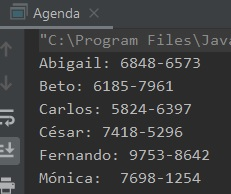
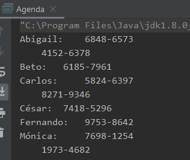

## Reto 01: Agenda Telefónica.

### OBJETIVO 

- Hacer uso de distintos tipos de colecciones.
- Aprender a ordenar colecciones con base en criterios predeterminados.

#### REQUISITOS 

1. Tener instalada la última versión del JDK 8.
2. Tener instalada la última versión de IntelliJ IDEA Community.


#### DESARROLLO

En este reto crearás una agenda telefónica simple.

1. La agenda se ordenará de forma ascendente por el nombre de la persona.
2. No es necesario crear objetos nuevos, sólo hacer uso de colecciones.
3. En la primera versión permitirá asociar un número telefónico por persona.
4. La agenda será estática, será necesario modificar el código fuente de la aplicación para agregar nuevas personas y números.
5. En la segunda versión permitirá asociar más de un número a una persona. 
6. Se les dará una prioridad de los números de las personas y deberán mostrarse con base a esa prioridad.
7. Para probar la agenda, ingresa los números de las siguientes personas, sin importar el orden en el que se ingresen, siempre deberán mostrarse de la misma forma:

		Abigail:  6848-6573
			  4152-6378
		Beto:     6185-7961
		Carlos:   5824-6397
			  8271-9346
		Cesar:    7418-5296
		Fernando: 9753-8642
		Monica:   7698-1254
			  1973-4682

<details>
	<summary>Solución</summary>
	

1. En el IDE IntelliJ IDEA, crea un nuevo proyecto llamado **Agenda**.

2. Dentro del proyecto crea un nuevo paquete llamado **org.bedu.java.jse.basico.sesion7.reto1**.

3. Dentro del paquete anterior crea una nueva clase llamada **Agenda** y dentro de esta un método **main**.

4. Para asociar los nombres con los números usaremos una colección de tipo **Map\<String, String\>**. Eso quiere decir que el nombre y el número serán ambos `String`. De las implementaciones de `Map`, usaremos un `TreeMap`, ya que por default ordena sus llaves de forma ascendente:
```java
	Map<String, String> agenda = new TreeMap<>();
```

5. Para la primera versión, colocaremos un nombre y un número de teléfono. Pondremos los nombres en desorden y los asociaremos con un solo número:
```java
	agenda.put("Carlos", "5824-6397");
        agenda.put("Beto", "6185-7961");
        agenda.put("Abigail", "6848-6573");
        agenda.put("César", "7418-5296");
        agenda.put("Mónica", " 7698-1254");
        agenda.put("Fernando", "9753-8642");
```

6. Para imprimir la información, obtendremos las llaves del mapa (los nombres) y lo mostraremos. Una vez que obtengamos la llave, con ella podemos obtener el valor (el número de teléfono) asociado a la misma:
```java
        for(String nombre : agenda.keySet()){
            System.out.println(nombre + ": " + agenda.get(nombre));
        }
```
7. Al ejecutar la aplicación, debemos obtener una salida similar a la siguiente:


con esto completamos la primera parte del reto.

8. Para la siguiente parte, haremos un cambio en el valor. En vez de usar un `String`, usaremos un `PriorityQueue` de un tipo propio. Esto es para que podamos asignar una prioridad al teléfono. 

Creamos una nueva clase llamada **Telefono** que tenga un **numero** y una **prioridad**. 
```java
	public class Telefono {
	    private final String numero;
	    private final int prioridad;

	    public Telefono(String numero, int prioridad) {
		this.numero = numero;
		this.prioridad = prioridad;
	    }

	    public String getNumero() {
		return numero;
	    }

	    public int getPrioridad() {
		return prioridad;
	    }
	}
```

9. La clase **Telefono** debe implementar la interface **Comparable**, usando la prioridad de los números de teléfono:
```java
	public class Telefono implements Comparable<Telefono> {
	    @Override
	    public int compareTo(Telefono telefono) {
		return this.prioridad - telefono.prioridad;
	    }
	}

```

10. En el método **main**, modificamos la declaración de **agenda**, para que ahora sus valores sean de tipo  **Queue\<Telefono\>()**:
```java
	Map<String, Queue<Telefono>> agenda = new TreeMap<>();
```

11. Ahora, inicializamos el valor de cada uno de los elementos del arreglo como una **PriorityQueue** vacía:
```java
	agenda.put("Carlos", new PriorityQueue<Telefono>());
        agenda.put("Beto", new PriorityQueue<Telefono>());
        agenda.put("Abigail", new PriorityQueue<Telefono>());
        agenda.put("César", new PriorityQueue<Telefono>());
        agenda.put("Mónica", new PriorityQueue<Telefono>());
        agenda.put("Fernando", new PriorityQueue<Telefono>());
```

12. Después, obtenemos esta **PriorityQueue** y le agregamos los números de **Telefono** correspondientes, para eso podemos auxiliarnos del método **Collections.addAll**:
```java
        Collections.addAll(agenda.get("Carlos"), new Telefono("5824-6397", 1), new Telefono("8271-9346", 2));
        Collections.addAll(agenda.get("Beto"), new Telefono("6185-7961", 1));
        Collections.addAll(agenda.get("Abigail"), new Telefono("6848-6573", 1), new Telefono("4152-6378", 2));
        Collections.addAll(agenda.get("César"), new Telefono("7418-5296", 1));
        Collections.addAll(agenda.get("Mónica"), new Telefono("7698-1254", 1), new Telefono("1973-4682", 2));
        Collections.addAll(agenda.get("Fernando"), new Telefono("9753-8642", 1));
```

13. El último paso es mostrar los números asociados. Para esto modificamos el ciclo ***for*** para obtener los elementos de la cola, junto y mostrarlos. El formato quedará algo extraño, pero en la siguiente sesión veremos cómo corregir eso:
```java
	 for (String nombre : agenda.keySet()) {
            Queue<Telefono> telefonos = agenda.get(nombre);

            System.out.print(nombre + ": ");

            Telefono tel = null;

            while ((tel = telefonos.poll()) != null){
                System.out.print("\t" + tel.getNumero() + "\n");
            }
        }
```

14. Al ejecutar la aplicación, debes obtener una salida como la siguiente:



</details> 


