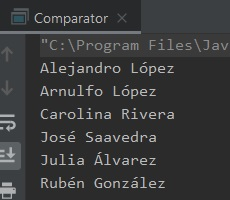

## Reto 2: Uso de Comparator para ordenar personas por nombre

### OBJETIVO 

- Aprender a usar la interface Comparator para ordenamiento de objetos propios.

#### REQUISITOS 

1. Tener instalada la última versión del JDK 8.
2. Tener instalada la última versión de IntelliJ IDEA Community.
3. Haber completado el Ejemplo 2, ya que se retomarán algunas cosas de este.


#### DESARROLLO

En este reto ordenarás a las personas por **nombre** y **apellido** en vez de por su estatura.

- Deberás crear una lista de personas, usando el mismo objeto **Persona** que en el Ejemplo 2.
- A la lista de personas del ejemplo 2, deberás agregar la siguiente entrada:
```java
	Persona persona6 = new Persona("Alejandro", "López", 1.68F);
```

- Al ordenar la lista, la salida deberá ser la siguiente:

			Alejandro López
			Arnulfo López
			Carolina Rivera
			José Saavedra
			Julia Álvarez
			Rubén González

<details>
	<summary>Solución</summary>
	
1. En el IDE IntelliJ IDEA, crea un nuevo proyecto llamado **Comparator**.

2. Dentro del proyecto crea un nuevo paquete llamado **org.bedu.java.jse.basico.sesion7.reto2**.

3. Dentro del paquete anterior crea una nueva clase llamada **Comparator** y dentro de esta un método **main**.

4. Copia la clase **Persona** del ejemplo 2:
```java
	public class Persona implements Comparable<Persona> {
	    private final String nombre;
	    private final String apellido;
	    private float estatura;

	    public Persona(String nombre, String apellido, float estatura) {
		this.nombre = nombre;
		this.apellido = apellido;
		this.estatura = estatura;
	    }

	    public String getApellido() {
		return apellido;
	    }

	    public String getNombre() {
		return nombre;
	    }

	    public float getEstatura() {
		return estatura;
	    }

	    @Override
	    public int compareTo(Persona persona) {
		return Float.compare(this.estatura, persona.estatura);
	    }
	}
```

5. En el método **main** crea la misma lista de personas del ejemplo 2, y agrega la nueva entrada que se incluye en las instrucciones del reto:

```java
        Persona persona1 = new Persona("Arnulfo", "López", 1.65F);
        Persona persona2 = new Persona("José", "Saavedra", 1.71F);
        Persona persona3 = new Persona("Carolina", "Rivera", 1.51F);
        Persona persona4 = new Persona("Rubén", "González", 1.60F);
        Persona persona5 = new Persona("Julia", "Álvarez", 1.54F);
        Persona persona6 = new Persona("Alejandro", "López", 1.68F);

        List<Persona> personas = new ArrayList<>();
        Collections.addAll(personas, persona1, persona2, persona3, persona4, persona5, persona6);
```

6. Crea una nueva clase llamada **ComparadorPersonas**, que implemente la interface **Comparator**:
```java
	public class ComparadorPersonas implements Comparator<Persona> {
	    @Override
	    public int compare(Persona persona1, Persona persona2) {
		
	    }
	}
```

7. En la implementación del método ***compare***, lo que haremos será concatenar el valor del nombre y apellido de cada una de las personas recibidas, y comparar estos dos valores usando el método ***compareTo*** que implementa `String`. Así, tendremos la comparación de `CarolinaRivera` con `JuliaÁlvarez`, las cuales se compararán para quedar en orden alfabético. 

```java
    public int compare(Persona persona1, Persona persona2) {
        String nombreCompletoPersona1 = persona1.getNombre() + persona1.getApellido();
        String nombreCompletoPersona2 = persona2.getNombre() + persona2.getApellido();

        return nombreCompletoPersona1.compareTo(nombreCompletoPersona2);
    }
```

8. En el método **main**, usamos la versión sobrecargada del método **Collections.sort**, la cual recibe como segundo parámetro una instancia de **Comparator**:

```java
	Collections.sort(personas, new ComparadorPersonas());
```

9. Al imprimir la lista, debemos obtener la salida mostrada en las instrucciones del reto. 



10. Si queremos modificar el orden de las personas, basta con crear una nueva clase que implemente **Comparator** y use una lógica distinta en la implementación del método **compare**. Por ejemplo, para ordenar las personas en orden alfabético inverso, basta con crear una nueva clase como la siguiente:
```java
    public class ComparadorInversoPersonas  implements Comparator<Persona> {
    @Override
    public int compare(Persona persona1, Persona persona2) {
        String nombreCompletoPersona1 = persona1.getNombre() + persona1.getApellido();
        String nombreCompletoPersona2 = persona2.getNombre() + persona2.getApellido();

        return nombreCompletoPersona2.compareTo(nombreCompletoPersona1);
    }
}

```

y usarla en el método **sort**
```java
	Collections.sort(personas, new ComparadorInversoPersonas());
```


</details> 

