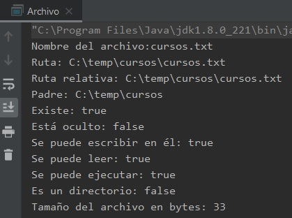

## Ejemplo 01: Propiedades de archivo

### OBJETIVO

- Aprender a usar los métodos de la clase **java.io.File** para obtener las propiedades de un archivo. 

#### REQUISITOS

1. Tener instalada la última versión del JDK 8.
2. Tener instalada la última versión de IntelliJ IDEA Community.


#### DESARROLLO

En este ejemplo, usarás los métodos de la clase **File** para leer algunas propiedades de un archivo y mostrarlas en pantalla.

En el código de la sesión encontrarás un archivo *zip* llamado **directorios**, el cual contiene la estructura de directorios que usaremos en las primeras actividades. Descarga y descomprime el directorio en una ruta accesible de tu computadora.

1. En el IDE IntelliJ IDEA, crea un nuevo proyecto llamado **Archivo**.

2. Dentro del proyecto crea un nuevo paquete llamado **org.bedu.java.jse.basico.sesion8.ejemplo1**.

3. Dentro del paquete anterior crea una nueva clase llamada **Archivo** y dentro de esta un método **main**.

4. En las carpetas del curso existe un archivo llamado **cursos.txt**, dentro del  directorio **temp/cursos**, este será el archivo del cual leeremos sus propiedades.

5. Crea una nueva instancia de la clase **File**, haciendo referencia a esta ruta. Dependiendo de tu sistema operativo, la dirección de los guiones que se usan para separar los directorios puede ir hacía un lado o hacia el otro (**\** o **/**):

```java
	File archivo = new File("C:/temp/cursos/cursos.txt");
```

6. Primero, mostramos algunos atributos genéricos del archivo, como son su nombre, ruta, directorio padre, si es un archivo oculto, o si existe el archivo.
```java
        System.out.println("Nombre del archivo:" + archivo.getName());
        System.out.println("Ruta: " + archivo.getPath());
        System.out.println("Ruta relativa: " + archivo.getAbsolutePath());
        System.out.println("Padre: " + archivo.getParent());
        System.out.println("Existe: " + archivo.exists());
        System.out.println("Está oculto: " + archivo.isHidden());
```

7. Ahora, verificamos si el archivo existe. Esto es una buena práctica, ya que se puede dar el caso en el que intentamos trabajar con un archivo que no existe. Para esa comprobación usamos el método **exists**:
```java
	if (archivo.exists()) {
	
	}
```

8. Una vez que hemos comprobado que el archivo existe, mostramos información adicional, como los permisos que tiene (lectura, escritura, ejecución), también validamos si se trata de un directorio o de un archivo:
```java
        if (archivo.exists()) {
            System.out.println("Se puede escribir en él: " + archivo.canWrite());
            System.out.println("Se puede leer: " + archivo.canRead());
            System.out.println("Se puede ejecutar: " + archivo.canExecute());
            System.out.println("Es un directorio: " + archivo.isDirectory());
            System.out.println("Tamaño del archivo en bytes: " + archivo.length());
        }
```

9. Al ejecutar la aplicación, debe haber una salida como la siguiente:




