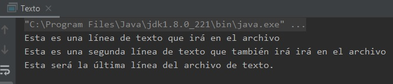

## Ejemplo 02: Manejo de archivos de texto.

### OBJETIVO

- Aprender a escribir archivos de texto plano.
- Aprender a leer archivos de texto plano.
- Aprender a hacer uso de Buffers para facilitar y hacer más eficiente el trabajo de lectura y escritura.

#### REQUISITOS

1. Tener instalada la última versión del JDK 8.
2. Tener instalada la última versión de IntelliJ IDEA Community.


#### DESARROLLO

En este ejemplo escribirás una serie de cadenas de texto en un archivo de texto plano, y posteriormente leerás el contenido de ese mismo archivo. 

1. En el IDE IntelliJ IDEA, crea un nuevo proyecto llamado **Texto**.

2. Dentro del proyecto crea un nuevo paquete llamado **org.bedu.java.jse.basico.sesion8.ejemplo2**.

3. Dentro del paquete anterior crea una nueva clase llamada **Texto** y dentro de esta un método **main**.

4. En el método **main** crea una nueva instancia de **FileWriter** pasando el siguiente parámetro a su constructor:
```java
	System.getProperty("user.home") + "/archivo.txt")
```

`System.getProperty` es una forma que tiene Java de leer propiedades, o valores que puede establecer el usuario, el sistema operativo o la máquina virtual. `"user.home"` hace referencia al directorio raíz del usuario con el que se está ejecutando la aplicación. Con esto lograremos que generar un nuevo archivo en el directorio raíz del usuario que estás usando.

5. Crea una nueva instancia de **BufferedWriter**, usando en su constructor la instancia de **FileWriter** creada hace un momento. No es necesario declarar dos variables, todos los pasos anteriores pueden encadenarse, de la siguiente forma:
```java
	BufferedWriter bw = new BufferedWriter(new FileWriter(System.getProperty("user.home") + "/archivo.txt"));
```


 6. Ahora puedes usar el método **write** de **BufferedWriter** para escribir líneas de texto plano, de la siguiente forma:
 ```java
 	bw.write("Esta es una línea de texto que irá en el archivo");
 ```
 
 7. Al momento de escribir una línea de texto, no se inserta de forma automática un salto de linea. Esto quiere decir que, si insertamos una nueva línea, esta quedará justo al lado de la que acabas de escribir. Para evitar esto, **BufferedWriter** tiene el método **newLine** que inserta un salto de línea:
 ```java
 	bw.newLine();
 ```
 
 8. Otra forma de insertar una nueva línea, es usar el caracter de salto de línea (`\n`) al inicio o al final del texto que estás insertando:
 ```java
 	bw.write("Esta es una segunda línea de texto que también irá en el archivo\n");	
 ```
 
 9. Finalmente, escribimos una línea más de texto y después cerramos el buffer de escritura con el método **close**:
 ```java
  	bw.write("Esta será la última línea del archivo de texto.");

        bw.close();
 ```
 
 10. Si ejecutas la aplicación en este punto, verás aparecer el archivo "archivo.txt" y adentro el contenido que hemos escrito.
 
 
 
11. Ahora, crearemos la sección de código que se encarga de la lectura del archivo. De forma similar a como creamos el **BufferedWriter**, crea un nuevo **BufferedReader** que reciba en su constructor un **FileReader** y que lea el archivo que creamos hace un momento:
 ```java
 	BufferedReader br = new BufferedReader(new FileReader(System.getProperty("user.home") + "/archivo.txt"));
 ```
 
12. **BufferedReader** proporciona el método **readLine** el cual devuelve línea a línea el contenido del archivo. Podemos ciclar llamando a este método hasta que regrese el valor de **null**. En ese momento sabremos que ya no hay más líneas que leer dentro del archivo:
```java
	String linea = null;

        while ((linea = br.readLine()) != null) {
            System.out.println(linea);
        }
```
12. Finalmente, ejecutamos la aplicación y con esto debemos ver en la consola el mismo texto que escribimos en el archivo:

 
