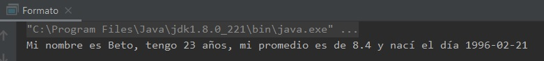
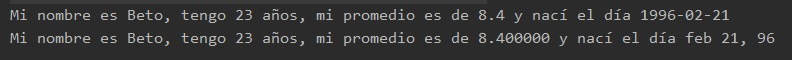
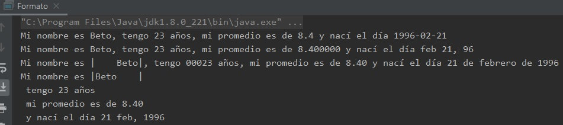

## Ejemplo 03: Formateo de información.

### OBJETIVO

- Aprender a dar formato a tipos de datos de texto numérico y fechas para mostrar al usuario.
- Practicar el uso de los métodos ***printf*** y ***String.format*** para dar formato a la información.
- Hacer uso de distintas banderas de formato.

#### REQUISITOS

1. Tener instalada la última versión del JDK 8.
2. Tener instalada la última versión de IntelliJ IDEA Community.


#### DESARROLLO

En este reto usarás distintas banderas y modificadores de formato para cambiar la forma en la que se muestra información al usuario en consola.

1. En el IDE IntelliJ IDEA, crea un nuevo proyecto llamado **Formato**.

2. Dentro del proyecto crea un nuevo paquete llamado **org.bedu.java.jse.basico.sesion8.ejemplo3**.

3. Dentro del paquete anterior crea una nueva clase llamada **Formato** y dentro de esta un método **main**.

4. Dentro del método **main** vamos a definir cuatro constantes, que será la información que mostraremos el usuario:
```java
 	final String NOMBRE = "Beto";
        final int EDAD = 23;
        final float PROMEDIO = 8.4F;
        final LocalDate FECHA_NACIMIENTO = LocalDate.of(1996, Month.FEBRUARY, 21);
```

5. Si quisiéramos mostrar esta información al usuario como lo hemos hecho hasta ahora, tendríamos que concatenar cada una de las constantes anteriores a una serie de cadenas fijas, de la siguiente forma:
```java
	System.out.println("Mi nombre es " + NOMBRE + ", tengo " + EDAD + " años, mi promedio es de " + PROMEDIO + " y nací el día " + FECHA_NACIMIENTO);
```

6. Al ejecutar la aplicación, obtendremos una salida similar a la siguiente en la consola:



7. Ahora haremos una modificación, en vez de usar el método **println** usaremos el método **printf**, el cual permite dar formato a la cadena de salida. Usaremos los caracteres básicos y solo haremos algo diferente en la fecha, para colocar el índice del argumento indicando que se usará el cuarto argumento para todos los elementos de la fecha.

```java
	System.out.printf("Mi nombre es %s, tengo %d años, mi promedio es de %f y nací el día %4$tb %4$te, %4$ty\n", NOMBRE, EDAD, PROMEDIO, FECHA_NACIMIENTO);
```

el uso del método anterior es más flexible que el primer caso, ya que la cadena que contiene la información podría venir de una variable, un archivo de configuración, o algún otro elemento externo. Esto nos ayudaría a que dicha salida fuera dinámica:

8. Al ejecutar la aplicación, la salida en consola es ligeramente distinta a la primera. 



vemos que la fecha se muestra de una forma mucho más clara. 

9. Haremos una nuevamente una modificación. En el primer especificador de formato (el que imprime el nombre) indicaremos que la longitud mínima (width) será de 8 caracteres
```java
	%8s
```

para distinguir claramente los 8 caracteres, colocaremos el especificador entre símbolos de *pipe* (**|**):
```java
	|%8s|
```
10. En el segundo especificador (el que imprime la edad), indicaremos que la longitud mínima del dato debe ser de 5 caracteres, y que debe rellenar con ceros a la derecha hasta alcanzar esta longitud:
```java
	%05d
```
11. En el tercer modificador (el del promedio) indicaremos que solo se deben mostrar dos caracteres después del punto decimal:
```java
	%.2f
```

12. En el cuarto modificador (los de la fecha) indicaremos que se debe mostrar completo el nombre del mes, y que el año se debe mostrar con 4 dígitos:
```java
	%4$te de %4$tB de %4$tY
```

13. Finalmente, en vez de usar el método ***printf*** usaremos el método estático **format** de la clase `String`:
```java
	System.out.println(String.format("Mi nombre es |%8s|, tengo %05d años, mi promedio es de %.2f y nací el día %4$te de %4$tB de %4$tY", NOMBRE, EDAD, PROMEDIO, FECHA_NACIMIENTO));
```

14. Para terminar el ejemplo, colocaremos el especificador para salto de línea (**%n**) después de cada uno de los otros especificadores; con esto lograremos que después de cada dato haya un salto de línea:
```java
	System.out.printf("Mi nombre es |%-8s|%n tengo %d años %n mi promedio es de %.2f%n y nací el día %4$td %4$tb, %4$tY", NOMBRE, EDAD, PROMEDIO, FECHA_NACIMIENTO);
```

15. Con esto, podemos ver la salida de cada uno de los formatos que colocamos:


