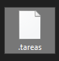

## Postwork 08: Formateo de mensajes y almacenamiento de tareas en archivo

### OBJETIVO

- Realizar el formateo de los mensajes dinámicos que se muestran al usuario.
- Aprender a almacenar el estado de la aplicación, para que al momento de salir las tareas se guarden en un archivo.
- Aprender a leer el estado de la aplicación desde un archivo, para volver a crear la lista de tareas una vez que la aplicación se inicia.

#### REQUISITOS

1. El avance del postwork de la sesión 07.


#### DESARROLLO

En este postwork trabajarás con los mensajes dinámicos que se muestran al usuario (aquellos que muestran el valor de alguna variable). Para eso, harás uso del método ***printf*** y los especificadores de formato visto durante la sesión. 

Además, guardarás el estado de la aplicación, para que la lista de tareas sea persistente aún después de cerrar la aplicación. De esta forma podrás usarla como una verdadera lista de seguimiento de tareas. Para lograr esto, deberás convertir las clases **Tarea** y **ListaTareas** en **Serializable** y hacer uso de las clases ***ObjectOutputStream*** y ***ObjectInputStream***.

<details>
        <summary>Solución</summary>

1. En la clase **ListaTareasMain**, justo después de leer la opción seleccionada por el usuario, se muestra la opción seleccionada. El primer cambio será modificar la instrucción **println** por **printf** y usar el especificador de formato para mostrar números enteros. Cambia la siguiente instrucción:
```java
        System.out.println("\n\nLa opción seleccionada es: " + opcionSeleccionada);
```

por:
```java
        System.out.printf("%n%nLa opción seleccionada es: %d%n", opcionSeleccionada);
```

2. En la clase **ListasTareas**, dentro del método **verListaTareas** existe un ciclo en el que se muestran las listas de tareas que se han dado de alta. Dentro de ese ciclo reemplaza el siguiente código:
```java
        System.out.println((i + 1) + " - " + listasTareas.get(i).getNombre());
```

por:
```java
        System.out.printf("%d - %s%n", (i + 1), listasTareas.get(i).getNombre());
```

3. En el método **actualizarListaDeTareas** en el `case 2:` cambia:
```java
        System.out.println("Se eliminó la tarea " + t1.getNombre());
```

por:
```java
        System.out.printf("Se eliminó la tarea %s%n", t1.getNombre());
```

y en el `case 3:` cambia:
```java
        System.out.println("La tarea " + t2.getNombre() + " se completó el " + t2.getFechaRealizacion());      
```
por:
```java
        System.out.printf("La tarea %s se completó el %2$te de %2$tB de %2$tY%n", t2.getNombre(), t2.getFechaRealizacion());
```
4. Finalmente, en el método **eliminarListaDeTareas** cambia:
```java
        System.out.println("Se eliminó la lista de tareas: " + listaEliminada.getNombre());
```
por:
```java
        System.out.printf("Se eliminó la lista de tareas: %s%n", listaEliminada.getNombre());
```

5. Ahora, haremos que el estado de la aplicación sea persistente. Esto será lo último que hagamos durante este curso. Lo primero es indicar que las clases **Tarea** y **ListaTareas**, que se encuentran en el subpaquete de **modelo** implementen la interface **java.io.Serializable**. Esto le indica a la JVM que los objetos de estas clases pueden ser enviadas a través de un flujo de bytes:

```java
        public class Tarea implements Serializable {
                ...
        }

        public class ListaTareas implements Serializable {
                ...
        }

```
6. Lo siguiente es agregar una constante que indique la ruta y nombre del archivo en el que se guardará la información. En la clase **ListasTareas**, agregaremos esta constante:

```java
        private static final String NOMBRE_ARCHIVO = System.getProperty("user.home") + "/.tareas";
```

Esto es una buena práctica, ya que estarás leyendo y escribiendo información en este archivo. De esta forma te aseguras de que ambos procesos usen exactamente los mismos nombres; además, si en algún momento decides cambiar la ubicación o el nombre del archivo, bastará con modificar la constante y de inmediato todos los lugares en donde se usa estarán actualizados.

7. Dentro de esta misma clase crea el método que cargará la lista de tareas. Este método se llamará **cargaTareas**; no recibirá ningún parámetro ni devolverá nada, pero si ocurre algún problema al momento de leer el archivo, será necesario reportar dicho problema a través de lanzar un error, conocido como Excepción. La firma del método es:

```java
        public void cargaTareas() throws Exception {
        }
```

8. Dentro de este método, lo primero será verificar si el archivo existe. Si no existe, puedes asumir que es la primera vez que se ejecuta la aplicación y por lo tanto aún no existen listas ni tareas:
```java
        if (new File(NOMBRE_ARCHIVO).exists()) {
        
        }
```

9. Si el archivo existe, crea una instancia de **ObjectInputStream**, que te permitirá recrear los objetos guardados en el archivo. Como la entrada de la información será un archivo, debes crear esta instancia usando un **FileInputStream** para leer del archivo cuyo nombre declaramos anteriormente en la constante:

```java
        ObjectInputStream ois = new ObjectInputStream(new FileInputStream(NOMBRE_ARCHIVO));
```

10. **ObjectInputStream** tiene un método llamado **readObject**, el cual devuelve un objeto con el contenido del archivo. Debes realizar un *cast* de este objeto genérico a una lista de **ListaTareas**, que es lo que guardaremos en el archivo en unos momentos:

```java
        listasTareas = (List<ListaTareas>) ois.readObject();
```

esto es todo, con este método podrás leer nuevamente las tareas al iniciar la aplicación.

11. Lo siguiente es invocar a este método. Para ello, agrega un constructor de la clase e invoca a **cargaTareas** dentro de este. s importante que el constructor también lance una excepción, de esta forma si ocurre un error en la lectura del archivo, el error se propagará hasta el elemento que cree la nueva instancia de **ListasTareas**, que en este caso es el método **main**:
```java
    public ListasTareas() throws Exception {
        cargaTareas();
    }
```

12. Ahora, agrega el método que permitirá guardar la lista de tareas. En la clase **ListasTareas** agrega un método llamado **guardarTareas**, el cual use un **ObjectOutputStream** para guardar la lista de tareas en el archivo apuntado por la constante. **ObjectOutputStream** proporciona el método **writeObject** para escribir el objeto en el archivo. 
```java
    public void guardarTareas() throws Exception {
        ObjectOutputStream oos = new ObjectOutputStream(new FileOutputStream(NOMBRE_ARCHIVO));
        oos.writeObject(listasTareas);
    }
```

13. En el método **main** tendrás que hacer dos cambios. El primero es invocar al método **guardarTareas** que acabas de crear. Esto debe ocurrir al momento de salir de la aplicación. En el método **main** colocaste una instrucción **switch**, y en el **case 6** ocurre la salida de la aplicación. En este momento lo único que haces es mostrar un mensaje. Antes de mostrar el mensaje deberás guardar el estado de la aplicación:
```java
        case 6:
                lista.guardarTareas();
                System.out.println("Saliendo de la aplicación.");
                break;
```
14. El segundo cambio que debes hacer es indicar que el método **main** también puede lanzar una excepción; esto hará que, si ocurre algún error, el mismo se propague hasta la JVM y haga que la aplicación termine:
```java
        public static void main(String[] args) throws Exception {
                ...
        }
```

15. Para terminar, solo queda modificar el menú de opciones que se le muestran al usuario, ahora la opción para salir debe indicar también que la aplicación se guardará. En el método **muestraOpciones** modifica la última opción de `Salir` a `Guardar y Salir`:
```java
        System.out.println("6. Guardar y Salir");
```

16. Con esto hemos terminado. Si ejecutas la aplicación y crear algunas tareas y listas y después sales de la misma, en el directorio de tu usuario deberá aparecer un nuevo archivo llamado **.tareas**. Si vuelves a ejecutar la aplicación y revisas las listas de tareas existentes, estas deben estar como quedaron en la última ocasión:



</details>


