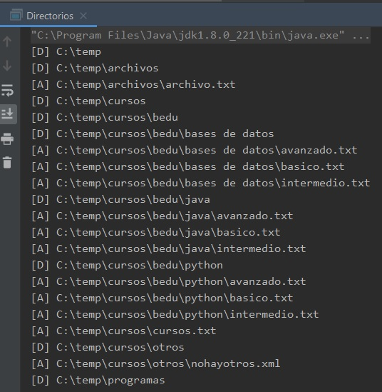
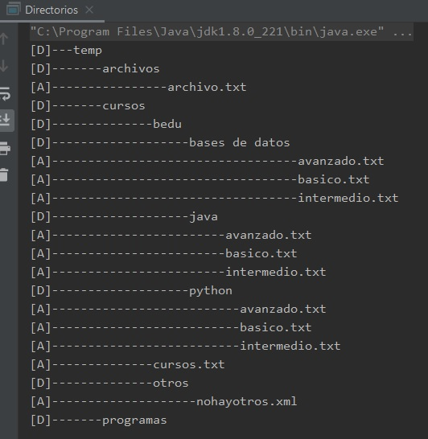

## Reto 01: Árboles de subdirectorios

### OBJETIVO 

- Aprender a usar los métodos de la clase **File** para distinguir si apunta a un directorio o a un subdirectorio.

#### REQUISITOS 

1. Tener instalada la última versión del JDK 8.
2. Tener instalada la última versión de IntelliJ IDEA Community.

#### DESARROLLO

En este reto le indicará a la aplicación un directorio raíz, y leerás todos los subdirectorios y archivos contenidos en ese directorio, hasta mostrar todo el contenido del árbol de directorios.

- Deberás mostrar una línea por cada archivo o directorio, mostrando sólo su nombre (no la ruta absoluta).
- Deberás colocar una marca al inicio de la línea, indicando si se trata de un archivo (***A***) o un directorio (***D***).
- Deberás mostrar una serie de guiones que representen el nivel de profundidad del archivo o directorio en el árbol. 
- La siguiente salida **NO** es válida:



- La siguiente **SÍ** es una salida válida:



<details>
	<summary>Solución</summary>
	
1. En el IDE IntelliJ IDEA, crea un nuevo proyecto llamado **Directorios**.

2. Dentro del proyecto crea un nuevo paquete llamado **org.bedu.java.jse.basico.sesion8.reto1**.

3. Dentro del paquete anterior crea una nueva clase llamada **Directorios** y dentro de esta un método **main**.

4. Lo primero que debes hacer es colocar un directorio que será el directorio raíz, a partir del cual comenzará a revisar la aplicación. 
```java
	File directorioInicial = new File( "C:/temp");	
```

5. Ahora, crea un método que será el que se encargue de colocar las marcas al inicio de las líneas de información y de colocar los guiones que representan los directorios padres. Para calcular el número de guiones que se pondrán, puedes usar el método ***length*** de la clase **String**, la cual regresa el número de caracteres en la cadena, que en este caso será el directorio padre:
```java
    private static void colocaEspacios(String directorioPadre, char simbolo){
        System.out.print("[" + simbolo + "]");

        for (int i = 0; i < directorioPadre.length(); i++) {
            System.out.print("-");
        }
    }
```` 

6. Ahora crea el método que tendrá la lógica principal de la aplicación. Este método se encargará de recibir el directorio actual que se está revisando, por lo que este será su único parámetro:
```java
	private static void muestraContenidoDirectorio(File directorio) {
	
	}
```

7. Como en este punto puedes estar seguro de que lo que el método recibe como parámetro es un directorio, puedes iniciar mostrando el símbolo del directorio, el número de guiones que representan su profundidad (o la ruta de su directorio padre) y su nombre:
```java
	colocaEspacios(directorio.getParent(), 'D');
        System.out.println(directorio.getName());
```

8. A continuación, obtén el contenido del directorio (subdirectorios y archivos) usando el método **listFiles**, el cual regresa un arreglo de elementos **File**:

```java
	File[] subdirectorios = directorio.listFiles();
```

9. Con el arreglo anterior, puedes ciclar a través de todos sus elementos preguntando si se trata de un archivo o de un directorio:
```java
	for (File archivo : subdirectorios) {
            if (archivo.isFile()) {
                
		
            } else if (archivo.isDirectory()) {
                
		
            }
        }
```

10. Si se trata de un archivo, muestra el símbolo, los guiones y el nombre del archivo, justo como hiciste el inicio del método:
```java
	if (archivo.isFile()) {
            colocaEspacios(archivo.getParent(), 'A');
            System.out.println(archivo.getName());
        }
```

11. Si se trata de un directorio, simplemente vuelve a invocar al método **muestraContenidoDirectorio** pasando este nuevo directorio como argumento. A esto (invocar un método dentro del mismo método) se le conoce con el nombre de **recursividad**:

```java
	else if (archivo.isDirectory()) {
                muestraContenidoDirectorio(archivo);
        }
```

12. Esto es todo. Al ejecutar la aplicación debes obtener una salida como la siguiente:


</details> 


