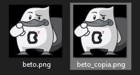

## Reto 02: Lectura y escritura de archivos binarios.

### OBJETIVO 

- Aprender la forma de leer archivos binarios.
- Aprender la forma de leer archivos binarios.
- Aprender a hacer uso de buffers para leer y escribir archivos binarios.

#### REQUISITOS 

1. Tener instalada la última versión del JDK 8.
2. Tener instalada la última versión de IntelliJ IDEA Community.

#### DESARROLLO

En este reto realizarás le lectura y escritura de un archivo binario, en este caso una imagen.

- Copia la siguiente imagen de *Beto*:


- Lee el archivo anterior y cópialo a un nuevo archivo llamado ***beto_copia.png***. Abre el archivo con un visor de imágenes para comprobar que se copió de forma correcta y completa.	
<details>
	<summary>Solución</summary>
	
1. En el IDE IntelliJ IDEA, crea un nuevo proyecto llamado **Binario**.

2. Dentro del proyecto crea un nuevo paquete llamado **org.bedu.java.jse.basico.sesion8.reto2**.

3. Dentro del paquete anterior crea una nueva clase llamada **Binario** y dentro de esta un método **main**.

4. Lo primero será crear la instancia de ***BufferedInputStream***. Similar al ejemplo anterior, esta instancia se construirá usando un **FileInputStream** al cual le indicarás el nombre del archivo **beto.png**. Al solo colocar el nombre del archivo, sin directorio, la aplicación buscará que la imagen esté en el mismo directorio en el que se está ejecutando:
```java
	BufferedInputStream bis = new BufferedInputStream(new FileInputStream("beto.png"));
```

5. También, crea la instancia de **BufferedOutputStream**. Esta instancia necesita un **FileOutputStream** y el nombre del archivo de salida, en este caso ***beto_copia.png***:
```java
	BufferedOutputStream bos = new BufferedOutputStream(new FileOutputStream("beto_copia.png"));
```
6. En esta ocasión, necesitarás un segundo buffer que será un arreglo de bytes en el que se colocará la información leída con el objeto **bis**, y el cual escribirás en el archivo de salida con **bos**. Este arreglo de bytes puede ser de cualquier tamaño, para este ejemplo puedes usar 1024:
```java
	byte[] buffer = new byte[1024];
```

7. El siguiente paso es leer la imagen de entrada y copiarla a la imagen de salida. Para leer debes usar el método **read**, el cual colocará la imagen en el arreglo de bytes **buffer** y regresará el número de bytes que leyó. Este último valor es muy importante porque en el ciclo final de lectura, es muy posible que se lean menos de los 1024 bytes, que es el tamaño del buffer; si esto ocurre, también debeos escribir el número correcto de bytes en el archivo de salida.

Cuando el objeto **bis** termine de leer el archivo, indicará que leyó **0** bytes. Esta es la indicación de que se ha terminado con la lectura:
```java
	int bytesLeidos = 0;

        while ((bytesLeidos = bis.read(buffer)) > 0){
            bos.write(buffer, 0, bytesLeidos);
        }
```

8. Para terminar, cierra el archivo de lectura y el de escritura con el método **close**:

```java
	bos.close();
        bis.close();
```
9. Al ejecutar la aplicación, debes ver las dos imágenes, la original y la copia.




</details> 


